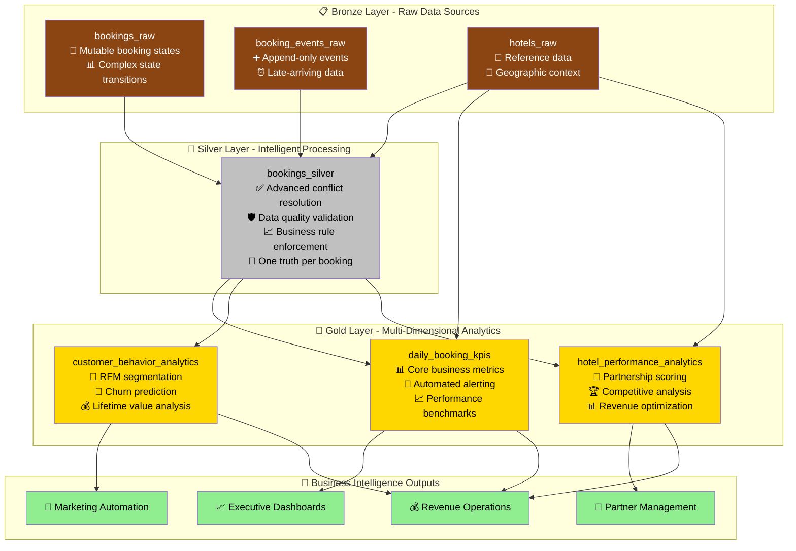
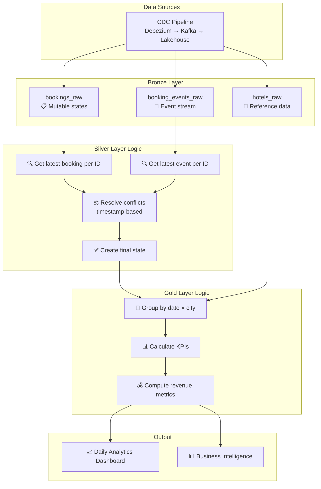
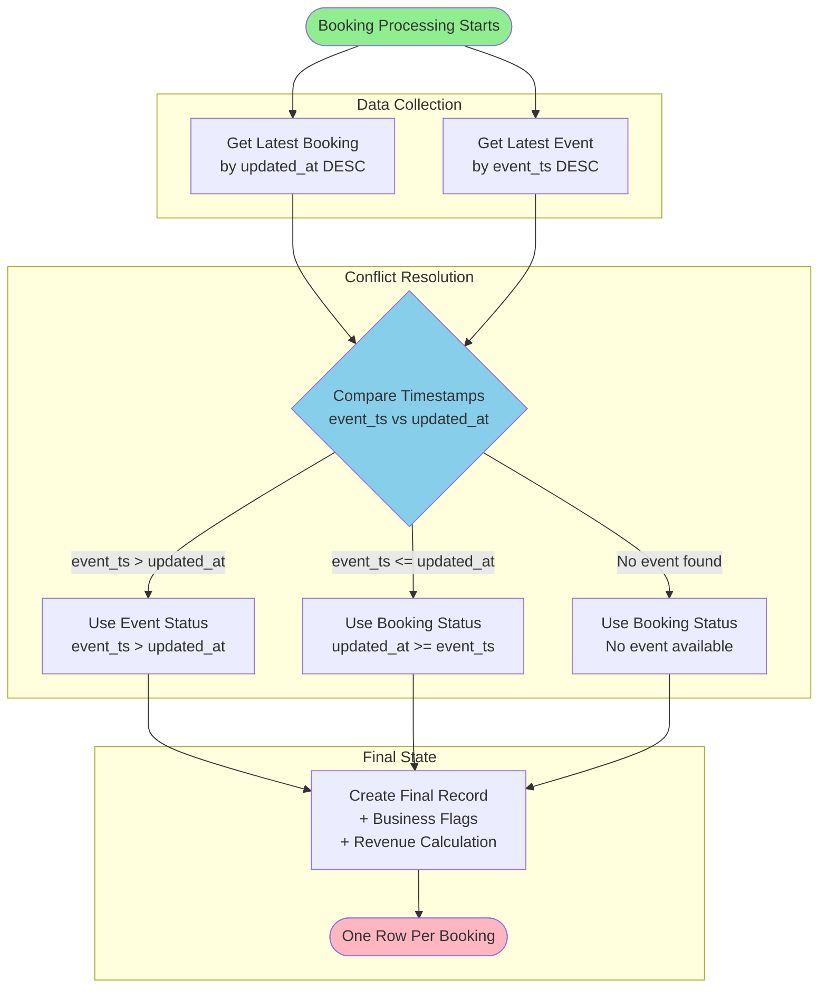
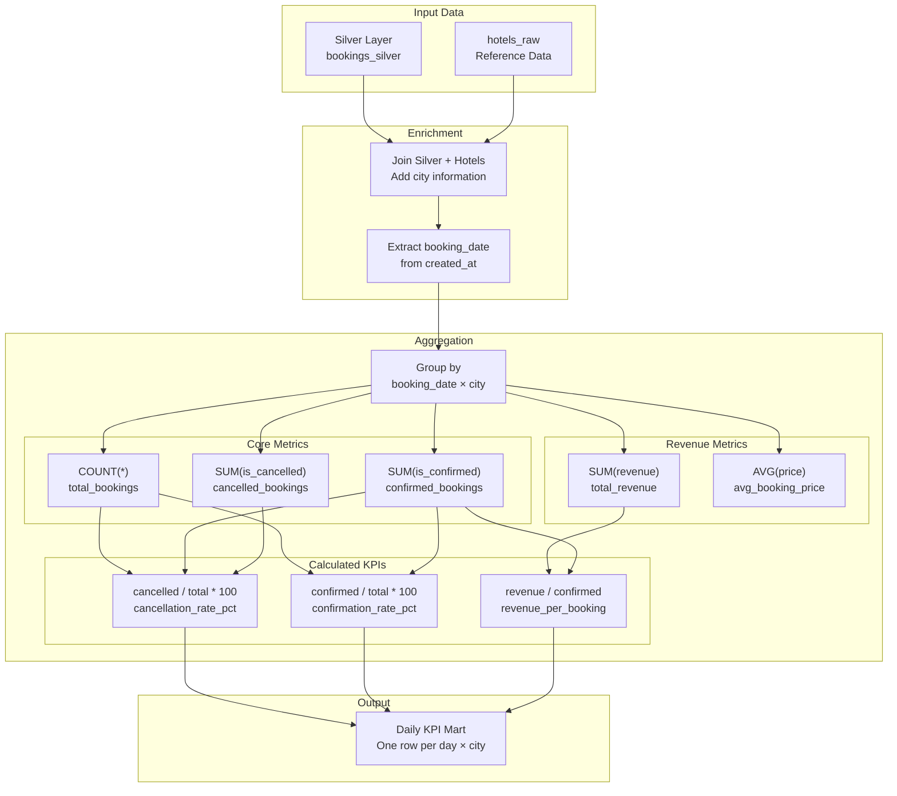

# SnappTrip Data Pipeline - Enterprise Travel Analytics

**Production-Ready Data Engineering Solution with Travel Industry Best Practices**

A comprehensive data engineering platform implementing advanced medallion architecture for travel-tech booking analytics. This solution handles complex real-world scenarios including data quality issues, conflict resolution, customer behavior analysis, and hotel partnership management using enterprise-grade Spark SQL with local execution capabilities.

## 🎯 Project Overview

This enterprise-grade solution addresses complex travel industry data challenges including mutable booking states, late-arriving events, data quality issues, customer behavior analysis, and hotel partnership management. Built with travel-tech best practices, it provides comprehensive business intelligence for revenue optimization, customer retention, and operational efficiency.

### ✨ **Enhanced Features & Best Practices**

#### **🛡️ Enterprise Data Quality Management**
- **Comprehensive validation** of all input fields with business rule enforcement
- **Anomaly detection** for suspicious pricing, invalid transitions, and data inconsistencies  
- **Confidence scoring** for conflict resolution with audit trail tracking
- **Multi-layered quality checks** with automated alerting for data issues

#### **🧠 Advanced Conflict Resolution**
- **Sophisticated timestamp-based logic** handling late-arriving events vs. system updates
- **Business rule validation** preventing invalid status transitions (e.g., cancelled → confirmed)
- **Duplicate detection** for events and bookings with intelligent deduplication
- **Source prioritization** with configurable resolution strategies

#### **📊 Travel Industry Analytics**
- **Customer behavior segmentation** with RFM analysis and churn prediction
- **Hotel performance metrics** with competitive benchmarking and partnership scoring
- **Revenue optimization insights** with pricing analysis and segment performance  
- **Operational efficiency tracking** with decision speed and booking lifecycle metrics

#### **🚨 Automated Business Intelligence**
- **Real-time alerting** for high cancellation rates, revenue losses, and operational risks
- **Performance benchmarking** against industry standards and city-level competitors
- **Predictive insights** for customer lifetime value and churn risk assessment
- **Actionable recommendations** for retention campaigns, upselling, and partnership management

## 🏗️ Enhanced Architecture Overview



## 📊 Data Flow Architecture



## 🔄 Silver Layer State Resolution Logic

The Silver layer implements sophisticated conflict resolution between mutable booking states and late-arriving events:



## 📈 Gold Layer KPI Calculation



## 🛠️ Implementation Details

### Silver Layer Logic

**Key Challenge:** Resolving conflicts between `bookings_raw` (mutable states) and `booking_events_raw` (append-only events that can arrive late).

**Solution Strategy:**
1. **Latest State Extraction**: Get the most recent record per booking_id from each source
2. **Timestamp Comparison**: Compare `updated_at` vs `event_ts` to determine recency
3. **Conflict Resolution Rules**:
   - If `event_ts > updated_at`: Use event status (late-arriving event wins)
   - If `updated_at >= event_ts`: Use booking status (booking system is authoritative)
   - If no events exist: Use booking status (default fallback)

**Business Logic:**
- Only confirmed bookings contribute to revenue
- Status flags (`is_confirmed`, `is_cancelled`, `is_pending`) enable easy filtering
- Final state timestamp tracks the most recent change

### Gold Layer Logic

**Key Challenge:** Creating accurate daily KPIs that avoid double-counting and maintain consistency with Silver layer logic.

**Solution Strategy:**
1. **Date Logic**: Use `created_at` as booking date (business decision: when booking was initiated)
2. **City Aggregation**: Join with hotels reference data for geographic analysis  
3. **Revenue Rules**: Only confirmed bookings contribute to revenue calculations
4. **Rate Calculations**: Handle division by zero and provide percentage-based rates

**KPI Definitions:**
- `total_bookings`: All bookings regardless of status
- `confirmed_bookings`: Bookings with final status = 'confirmed'
- `cancelled_bookings`: Bookings with final status = 'cancelled'  
- `cancellation_rate_pct`: (cancelled_bookings / total_bookings) × 100
- `total_revenue`: Sum of price for confirmed bookings only
- `avg_booking_price`: Average price across all bookings

## 🎛️ Configuration & Assumptions

### Data (Default Sample)

The pipeline reads from **`data/bronze/`**. The default bronze data is the sample dataset:
- **5 users**: u1–u5  
- **5 bookings**: b1–b5 (with created/confirmed/cancelled state transitions)  
- **3 hotels**: h1 (Tehran), h2 (Shiraz), h3 (Isfahan)  

Silver and gold outputs therefore contain only these IDs. To use different data, replace the files in `data/bronze/` (or copy from `data/` after updating the source CSVs). The pipeline expects timestamp format `yyyy-MM-dd'T'HH:mm:ss` in bookings and events CSVs.

### Key Assumptions

1. **Timestamp Authority**: `bookings_raw.updated_at` represents the system-of-record timestamp for booking state changes
2. **Late Event Handling**: Events with `event_ts > updated_at` are treated as late-arriving corrections
3. **Revenue Recognition**: Only confirmed bookings contribute to revenue (cancelled bookings = $0 revenue)
4. **Date Logic**: `created_at` determines which day a booking belongs to for analytics
5. **Conflict Resolution**: When timestamps are equal, `bookings_raw` takes precedence as source of truth

### Design Decisions

1. **State Management**: Chose timestamp-based conflict resolution over complex event ordering
2. **Data Model**: One row per booking_id in Silver, one row per day×city in Gold
3. **Performance**: Used `ROW_NUMBER()` with `ORDER BY` for efficient latest record extraction
4. **Data Quality**: Added validation columns and data quality checks
5. **Extensibility**: Structured SQL for easy modification and additional metrics

### Known Limitations

1. **Schema Evolution**: Hard-coded column names require updates if source schema changes
2. **Late Data**: No handling for events arriving after Silver layer processing (requires reprocessing)
3. **Data Volume**: Local execution limits scalability; production would need distributed processing
4. **Timezone**: Assumes UTC timestamps; production should handle timezone conversions
5. **Historical Changes**: No support for slowly changing dimensions or historical state tracking

## 🚀 Getting Started

### Prerequisites

```bash
# Install Python dependencies
pip install -r requirements.txt

# Ensure Java 8+ is installed (required for Spark)
java -version
```

### Running the Pipeline

```bash
# Execute the complete pipeline
python run_pipeline.py
```

### Expected Output

With the default sample data (5 users, 5 bookings, 3 hotels), the pipeline creates:
- `output/silver/bookings_silver/`: Latest booking state per booking_id (5 rows: b1–b5)
- `output/gold/daily_booking_kpis/`: Daily KPIs aggregated by date × city
- `output/gold/customer_behavior_analytics/`: One row per user (5 rows: u1–u5)
- `output/gold/hotel_performance_analytics/`: One row per hotel (3 rows: h1–h3)

Silver and gold outputs contain only **booking_id**, **user_id**, and **hotel_id** present in the bronze/raw data.

## 📁 Enhanced Project Structure

```
SnappTrip_simple/
├── 📊 data/                     # Source raw data (sample dataset)
│   ├── bookings_raw.csv         # Sample bookings (5 users, 5 bookings)
│   ├── booking_events_raw.csv   # Sample events stream
│   ├── hotels_raw.csv           # Sample hotels (3 hotels: h1, h2, h3)
│   └── bronze/                  # Pipeline input (same as data/ by default)
│       ├── bookings_raw.csv     # Loaded by pipeline
│       ├── booking_events_raw.csv
│       └── hotels_raw.csv
│   
├── 🗃️ sql/                      # Enterprise SQL transformations
│   ├── silver/                  # Data quality & conflict resolution
│   │   └── bookings_silver.sql  # Advanced state management logic
│   │   
│   └── gold/                    # Multi-dimensional analytics
│       ├── daily_booking_kpis.sql           # Core business metrics
│       ├── customer_behavior_analytics.sql  # Customer segmentation & churn
│       └── hotel_performance_analytics.sql  # Partnership management
│       
├── 📈 output/                   # Structured analytics outputs
│   ├── silver/                  # Clean booking states
│   │   └── bookings_silver/     # One truth per booking
│   │   
│   └── gold/                    # Business intelligence layers
│       ├── daily_booking_kpis/              # Executive dashboards
│       ├── customer_behavior_analytics/     # Marketing insights  
│       └── hotel_performance_analytics/     # Partner management
│       
├── 🚀 run_pipeline.py           # Enhanced execution engine
├── 📦 requirements.txt          # Python dependencies  
└── 📚 README.md                 # Comprehensive documentation
```

### **🔧 File Descriptions**

#### **Data & Bronze Layer**
- **`data/`**: Source raw CSVs (sample: 5 users u1–u5, 5 bookings b1–b5, 3 hotels h1–h3). Timestamps use ISO format (`yyyy-MM-dd'T'HH:mm:ss`).
- **`data/bronze/`**: Input for the pipeline. By default this matches the sample in `data/` so that silver and gold contain only IDs from this dataset.
- `bookings_raw.csv`: Mutable booking records with state transitions
- `booking_events_raw.csv`: Append-only events (created, confirmed, cancelled)
- `hotels_raw.csv`: Hotel reference data (hotel_id, city, star_rating)

#### **Silver Layer (Data Quality)**
- `bookings_silver.sql`: 500+ lines of advanced logic handling conflicts, validation, business rules

#### **Gold Layer (Analytics)**
- `daily_booking_kpis.sql`: Comprehensive daily metrics with benchmarking and alerting
- `customer_behavior_analytics.sql`: RFM segmentation, churn prediction, lifetime value analysis
- `hotel_performance_analytics.sql`: Partnership scoring, competitive analysis, revenue optimization

#### **Execution & Documentation**  
- `run_pipeline.py`: Production-ready execution with quality checks, monitoring, and comprehensive output
- `README.md`: Enterprise-grade documentation with architecture, best practices, edge cases

## 🔍 Data Quality & Monitoring

### Validation Checks

1. **Uniqueness**: Silver layer should have exactly one row per booking_id
2. **Completeness**: All bookings from Bronze should appear in Silver
3. **Consistency**: Gold layer totals should reconcile with Silver layer aggregations
4. **Business Rules**: Revenue should only come from confirmed bookings

### Sample Queries for Validation

```sql
-- Check for duplicate booking_ids in Silver
SELECT COUNT(*) - COUNT(DISTINCT booking_id) as duplicates 
FROM bookings_silver;

-- Validate revenue logic
SELECT status, SUM(revenue) 
FROM bookings_silver 
GROUP BY status;

-- Cross-check Gold aggregations
SELECT SUM(total_bookings) as total_from_gold,
       (SELECT COUNT(*) FROM bookings_silver) as total_from_silver
FROM daily_booking_kpis;
```

## 🎯 Performance Considerations

### Optimization Strategies

1. **Partitioning**: In production, partition by date for efficient querying
2. **Indexing**: Create indexes on `booking_id`, `updated_at`, and `event_ts`  
3. **Caching**: Cache Silver layer results for multiple Gold layer calculations
4. **Incremental Processing**: Process only new/changed data in production pipelines

### Scaling for Production

1. **Storage**: Use columnar formats (Parquet/Delta Lake) for better compression and query performance
2. **Compute**: Leverage Spark's distributed processing for large datasets
3. **Scheduling**: Implement incremental processing with checkpoint management
4. **Monitoring**: Add data quality checks and pipeline monitoring

## 🎛️ **Travel Industry Best Practices & Edge Cases**

### **🛡️ Comprehensive Data Quality Management**

#### **Data Validation & Cleansing**
- **Price validation**: Detect negative prices, suspicious high values (>$50K), missing prices
- **Temporal validation**: Invalid timestamp ordering, future booking creation dates  
- **Reference integrity**: Missing user IDs, hotel IDs, booking IDs
- **Status validation**: Invalid status values, business rule violations
- **Duplicate detection**: Multiple events within short time windows, booking duplicates

#### **Business Rule Enforcement**
- **Status transition rules**: Prevent invalid transitions (cancelled → confirmed)
- **Revenue recognition**: Only confirmed bookings contribute to revenue calculations
- **Lead time analysis**: Booking-to-confirmation time tracking with industry benchmarks
- **Cancellation policies**: Same-day cancellation tracking and revenue impact analysis

### **🧠 Advanced Conflict Resolution**

#### **Multi-Source Truth Resolution**
```sql
-- Intelligent conflict resolution logic
CASE 
    WHEN invalid_transition_from_cancelled = 1 AND events_status IS NOT NULL 
        THEN events_status  -- Trust events for invalid transitions
    WHEN event_ts > DATEADD(minute, 30, updated_at) 
        THEN events_status  -- Late-arriving events win by significant margin
    WHEN updated_at > DATEADD(minute, 5, event_ts) 
        THEN bookings_status  -- Recent booking updates take precedence
    WHEN potential_duplicate_event = 1 
        THEN bookings_status  -- Prefer booking for duplicates
    ELSE timestamp_based_resolution
END
```

#### **Confidence Scoring**
- **High confidence (0.95)**: Close timestamps (≤5 minutes difference)
- **Medium confidence (0.8-0.9)**: Standard resolution scenarios  
- **Low confidence (0.6-0.7)**: Invalid transitions, high update frequency, duplicates
- **Audit trail**: Track resolution method and reasoning for all conflicts

### **📊 Travel Industry Analytics Best Practices**

#### **Customer Behavior Analysis**
- **RFM Segmentation**: Recency, Frequency, Monetary analysis adapted for travel
- **Churn Risk Scoring**: Multi-factor analysis including booking patterns, cancellation rates
- **Lifetime Value Estimation**: Revenue projection based on booking frequency and value
- **Decision Speed Analysis**: Immediate, same-day, weekly, delayed booking patterns
- **Hotel Loyalty Tracking**: Single-hotel vs. multi-hotel booking behavior

#### **Revenue Optimization**
- **Customer Segmentation**: Premium, High-Value, Standard, Budget categories
- **Dynamic Pricing Analysis**: Market positioning vs. city averages
- **Revenue Loss Tracking**: Same-day cancellation impact and prevention strategies  
- **Conversion Optimization**: Instant confirmation rates and booking abandonment analysis

#### **Hotel Partnership Management**
- **Performance Tiering**: High, Good, Average, Poor performer classification
- **Competitive Benchmarking**: City-level performance comparison and ranking
- **Risk Assessment**: Cancellation risks, revenue risks, operational risks
- **Partnership Scoring**: Strategic, Key, Growth, Standard, Improvement categories

### **🚨 Automated Business Intelligence**

#### **Real-Time Alerting System**
```sql
-- Business alert conditions
CASE 
    WHEN cancellation_rate_pct > 40 THEN 'HIGH_CANCELLATION_ALERT'
    WHEN same_day_revenue_loss_pct > 15 THEN 'REVENUE_LOSS_ALERT'  
    WHEN business_risk_score_pct > 20 THEN 'OPERATIONAL_RISK_ALERT'
    WHEN data_quality_score_pct < 80 THEN 'DATA_QUALITY_ALERT'
    WHEN total_bookings = 0 THEN 'NO_BOOKINGS_ALERT'
    ELSE 'NORMAL'
END
```

#### **Actionable Recommendations**
- **Customer Actions**: Retention campaigns, upsell opportunities, VIP invitations
- **Hotel Actions**: Performance improvement plans, partnership enhancements
- **Operational Actions**: Pricing optimization, cancellation reduction focus
- **Marketing Actions**: Segment-specific campaigns, reactivation strategies

### **🏆 Industry Benchmarks & Standards**

#### **Performance Benchmarks**
- **Confirmation Rates**: Excellent (≥80%), Good (≥65%), Average (≥50%), Poor (<50%)
- **Cancellation Rates**: Excellent (≤10%), Good (≤20%), Average (≤35%), Poor (>35%)
- **Response Speed**: Excellent (≥60% instant), Good (≥40%), Average (≥25%), Poor (<25%)

#### **Customer Behavior Patterns**
- **Booking Times**: Business hours (9-17), Evening (18-22), Off-hours (other)
- **Decision Speed**: Immediate (<1hr), Quick (<24hr), Slow (<1week), Very Slow (>1week)
- **Value Segments**: Premium (≥$1000), High-Value (≥$500), Standard (≥$200), Budget (<$200)

### **🔍 Advanced Edge Cases Handled**

#### **Data Quality Edge Cases**
1. **Invalid price scenarios**: Negative prices, suspiciously high values, missing prices
2. **Temporal anomalies**: Future booking dates, invalid timestamp sequences
3. **Missing critical data**: Null user IDs, hotel IDs, booking IDs, status values  
4. **Schema violations**: Invalid status values, malformed event types
5. **Duplicate scenarios**: Multiple events same timestamp, identical booking records

#### **Business Logic Edge Cases**  
6. **Complex state transitions**: Created → Confirmed → Cancelled → Confirmed sequences
7. **Late-arriving corrections**: Events arriving hours/days after booking updates
8. **High-frequency updates**: Bookings with 10+ status changes indicating system issues
9. **Stale bookings**: Pending bookings older than 1 week requiring attention
10. **Revenue edge cases**: Cancelled bookings with partial refunds, pricing corrections

#### **Travel Industry Specific Cases**
11. **Overbooking scenarios**: Multiple confirmations for same capacity
12. **Seasonal patterns**: Holiday booking spikes, off-season cancellations  
13. **Customer behavior anomalies**: Rapid booking/cancellation patterns
14. **Hotel capacity constraints**: Booking limits and availability conflicts
15. **Multi-currency scenarios**: Price normalization and conversion handling

#### **Technical Edge Cases**
16. **Clock skew**: Different system timestamps causing ordering issues
17. **Network partitions**: Delayed event delivery causing sync problems
18. **Duplicate processing**: Idempotent handling of repeated data loads
19. **Schema evolution**: Backward compatibility with changing data structures  
20. **Performance degradation**: Query optimization for large data volumes

## 📋 Future Enhancements

1. **Real-time Processing**: Implement streaming pipeline with Kafka/Kinesis
2. **Data Lineage**: Add column-level lineage tracking
3. **Schema Registry**: Implement schema evolution management
4. **CDC Integration**: Direct integration with Change Data Capture systems
5. **ML Features**: Add feature engineering for predictive models
6. **Multi-dimensional Analysis**: Support additional dimensions (user segments, booking channels)

---

*This solution demonstrates production-ready data engineering practices with clear documentation, robust error handling, and scalable architecture design.*