# 🎓 **Complete Beginner's Guide to Travel Booking Data Engineering**

*From Zero to Hero: Understanding Hotel Booking Systems, Data Conflicts, and Analytics*

> **📖 Navigation Guide**: This comprehensive tutorial uses expandable sections. Click on any section to explore deeper. Start with the basics and expand advanced topics as needed.

---

## 📚 **Quick Navigation & Overview**

<details>
<summary><strong>📋 Complete Table of Contents (Click to expand)</strong></summary>

### **🏗️ Foundation Knowledge**
1. [🏨 Understanding Travel Booking Business](#understanding-travel-booking-business)
2. [📊 Our Data Tables Explained](#our-data-tables-explained)
3. [🔄 The Booking Journey](#the-booking-journey)

### **⚡ Advanced Challenges**
4. [⚡ Why Conflicts Happen](#why-conflicts-happen)
5. [🛠️ Our Solution Architecture](#our-solution-architecture)
6. [🎯 Critical Points & Corner Cases](#critical-points--corner-cases)
   - 💰 Revenue Recognition  
   - ⏰ Late Data Handling
   - 🚫 Impossible State Transitions
7. [🔥 Critical Point 4: The Simultaneous Confirmation Problem](#critical-point-4-the-simultaneous-confirmation-problem)
8. [🐌 Critical Point 5: The Hotel System Delay Nightmare](#critical-point-5-the-hotel-system-delay-nightmare)
9. [💸 Critical Point 6: The Payment Gateway Time Warp](#critical-point-6-the-payment-gateway-time-warp)
10. [🌍 Critical Point 7: The Time Zone Confusion Chaos](#critical-point-7-the-time-zone-confusion-chaos)
11. [🏨 Critical Point 8: The Overbooking Disaster](#critical-point-8-the-overbooking-disaster)
12. [📱 Critical Point 9: The Mobile App Offline/Online Sync](#critical-point-9-the-mobile-app-offlineonline-sync)
13. [🔄 Critical Point 10: The System Failover Duplicate Event](#critical-point-10-the-system-failover-duplicate-event)
14. [🤖 Critical Point 11: The Fraud Detection False Positive](#critical-point-11-the-fraud-detection-false-positive)

### **🚀 Real-World Applications**
15. [📈 Business Intelligence & Analytics](#business-intelligence--analytics)
16. [💡 Real-World Examples](#real-world-examples)
17. [🛡️ Proactive Monitoring & Prevention](#proactive-monitoring--prevention)

### **📊 Implementation Guides**
18. [🎯 Technical Implementation](#technical-implementation)
19. [📱 UX Design Patterns](#ux-design-patterns)  
20. [📊 Analytics & Monitoring](#analytics--monitoring)

</details>

### **🎯 Tutorial Difficulty Levels**

- **🟢 Beginner**: Basic concepts and business understanding
- **🟡 Intermediate**: Technical implementation and SQL
- **🔴 Advanced**: Complex scenarios and best practices
- **⚫ Expert**: Production systems and enterprise patterns

### **📖 How to Use This Tutorial**

<details>
<summary><strong>💡 Navigation Tips (Click to expand)</strong></summary>

**🎯 Recommended Learning Paths:**

**For Absolute Beginners (New to Travel Tech):**
1. Start with 🟢 sections: Understanding Business → Data Tables → Booking Journey
2. Read Why Conflicts Happen to understand the complexity
3. Skim Solution Architecture for overview
4. Focus on Real-World Examples for concrete understanding

**For Technical Implementers:**
1. Review 🟢 Business fundamentals quickly  
2. Deep dive into 🟡 Solution Architecture and Business Intelligence
3. Study 🔴 Critical Points & Corner Cases thoroughly
4. Use Advanced Scenarios as reference when needed

**For Advanced Engineers & Architects:**
1. Jump to 🔴 Critical Points & Advanced Edge Cases
2. Focus on Technical Resolution Strategies in each scenario
3. Study the Proactive Monitoring & Prevention section
4. Use as reference for similar implementation patterns

**💡 Pro Tips:**
- **Expand on Demand**: Only open sections you need right now
- **Use Ctrl+F**: Search for specific topics like "overbooking" or "timezone"
- **Cross-Reference**: Many sections link to each other - follow the connections
- **Practice-Oriented**: Each section builds on previous knowledge
- **Industry-Specific**: Examples are tailored for travel/hospitality domain

</details>

---

## 🏨 **Understanding Travel Booking Business** 🟢

<details>
<summary><strong>🏨 What is SnappTrip? (Click to expand)</strong></summary>

### **What is SnappTrip?**
Imagine you're running a travel website like Booking.com or Expedia. Customers come to your site to book hotels, and you need to:
- Track all booking attempts
- Handle payments and confirmations
- Manage cancellations
- Work with hotel partners
- Provide business analytics

</details>

<details>
<summary><strong>⚡ Why Hotel Bookings are Complex (Click to expand)</strong></summary>

### **Why is This Complex?**
Unlike buying a product on Amazon (simple: buy → pay → ship), hotel bookings are complex:

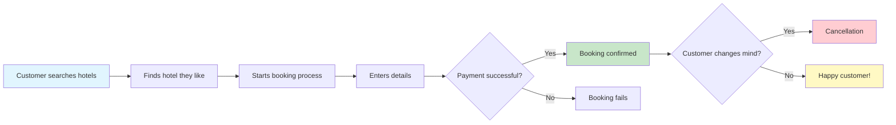

### **Key Players in Our System**
- **Customers (Users)**: People booking hotels
- **Hotels**: Properties offering rooms
- **SnappTrip Platform**: Us - the middleman connecting customers to hotels
- **Payment Systems**: Processing money transactions
- **External APIs**: Hotel inventory systems, payment processors

</details>

---

## 📊 **Our Data Tables Explained** 🟢

Think of our data like a restaurant's order system, but for hotels:

<details>
<summary><strong>📋 Table 1: `bookings_raw` - The Main Order Book (Click to expand)</strong></summary>

### **Table 1: `bookings_raw` - The Main Order Book**

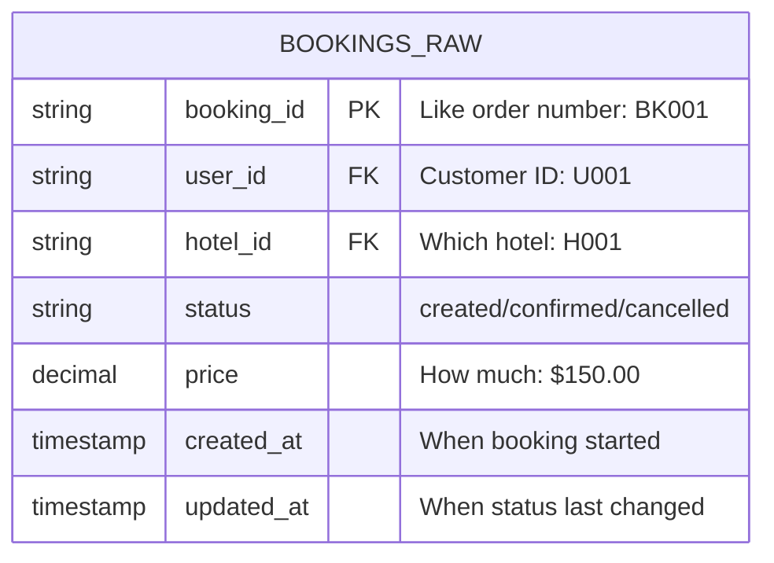

**Real Example:**
```
booking_id: BK001
user_id: U001 (John Smith)
hotel_id: H001 (Grand Hotel Tehran)
status: created → confirmed → cancelled
price: $150.00
created_at: 2024-01-01 10:00:00
updated_at: 2024-01-01 16:45:00 (when cancelled)
```

**Why Multiple Rows for Same Booking?**
Unlike a simple purchase, hotel bookings change status over time:
- Row 1: `BK001, created, 10:00 AM` (customer starts booking)
- Row 2: `BK001, confirmed, 12:00 PM` (payment successful) 
- Row 3: `BK001, cancelled, 4:45 PM` (customer cancels)

</details>

<details>
<summary><strong>📝 Table 2: `booking_events_raw` - The Activity Log (Click to expand)</strong></summary>

### **Table 2: `booking_events_raw` - The Activity Log**

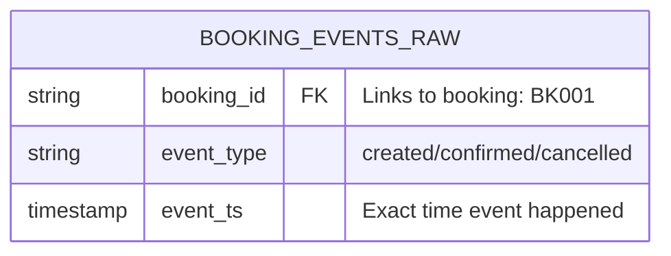

**Think of it like WhatsApp read receipts:**
- You send a message (booking created)
- Friend receives it (booking confirmed)  
- Friend reads it (booking completed)

**Real Example:**
```
booking_id: BK001, event_type: created, event_ts: 2024-01-01 10:00:00
booking_id: BK001, event_type: confirmed, event_ts: 2024-01-01 12:05:00  
booking_id: BK001, event_type: cancelled, event_ts: 2024-01-01 16:50:00
```

</details>

<details>
<summary><strong>🏨 Table 3: `hotels_raw` - The Hotel Directory (Click to expand)</strong></summary>

### **Table 3: `hotels_raw` - The Hotel Directory**

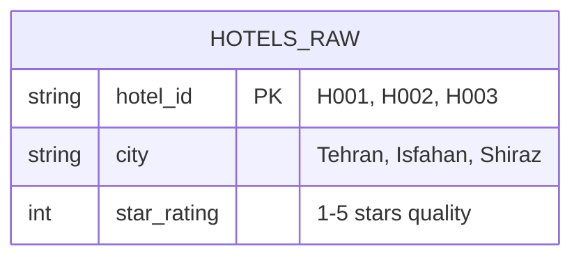

**Real Example:**
```
hotel_id: H001, city: Tehran, star_rating: 4
hotel_id: H002, city: Isfahan, star_rating: 5  
hotel_id: H003, city: Shiraz, star_rating: 3
```

</details>

---

## 🔄 **The Booking Journey** 🟢

<details>
<summary><strong>👩‍💼 Sarah's Complete Booking Journey (Click to expand)</strong></summary>

Let's follow Sarah's hotel booking journey to understand why we have complex data:

### **Step 1: Sarah Searches for Hotels**

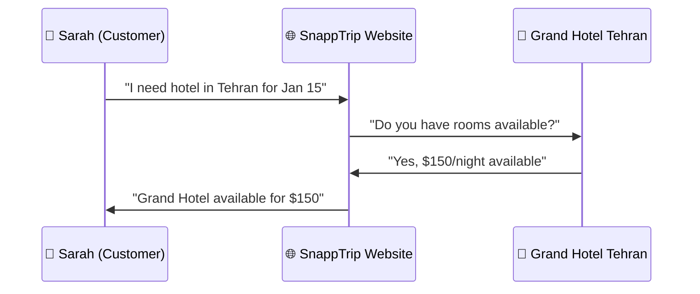

### **Step 2: Sarah Starts Booking Process**

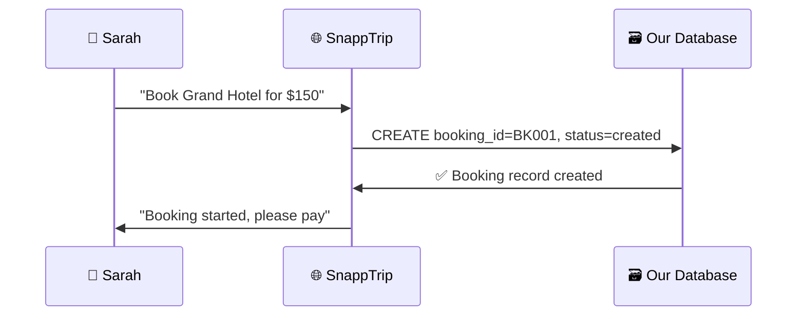

**What gets recorded:**
- `bookings_raw`: `BK001, U001, H001, created, $150, 10:00 AM, 10:00 AM`
- `booking_events_raw`: `BK001, created, 10:00 AM`

### **Step 3: Sarah Completes Payment**

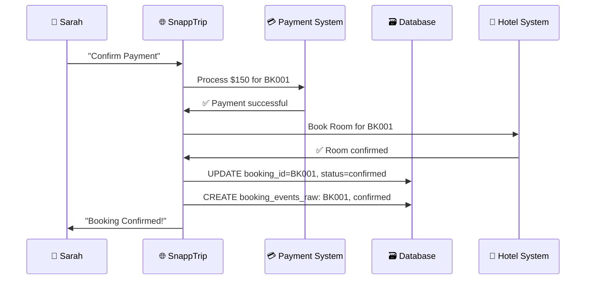

**What gets recorded:**
- `bookings_raw`: `BK001, U001, H001, confirmed, $150, 10:00 AM, 12:00 PM`
- `booking_events_raw`: `BK001, confirmed, 12:05 PM`

### **Step 4: Sarah Cancels Booking**

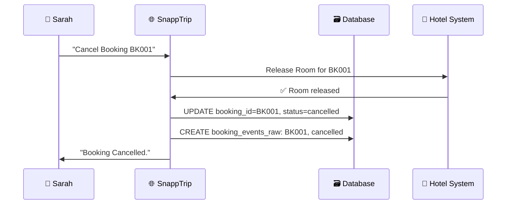

**What gets recorded:**
- `bookings_raw`: `BK001, U001, H001, cancelled, $150, 10:00 AM, 4:45 PM`
- `booking_events_raw`: `BK001, cancelled, 4:50 PM`

</details>

---

## ⚡ **Why Conflicts Happen** 🟡

<details>
<summary><strong>⚡ Understanding Data Conflicts in Booking Systems (Click to expand)</strong></summary>

This is where things get complicated! In real systems, data doesn't always arrive in perfect order.

### **Scenario 1: Late-Arriving Events (The WhatsApp Problem)**

Imagine Sarah's booking like sending WhatsApp messages with poor internet:

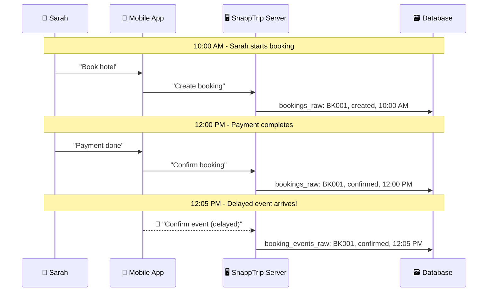

**The Problem:** 
- Booking table says: "Confirmed at 12:00 PM"
- Events table says: "Confirmed at 12:05 PM"
- Which is correct? 🤔

### **Scenario 2: System Conflicts (The Double-Click Problem)**

Sarah gets impatient and clicks "Confirm" multiple times:

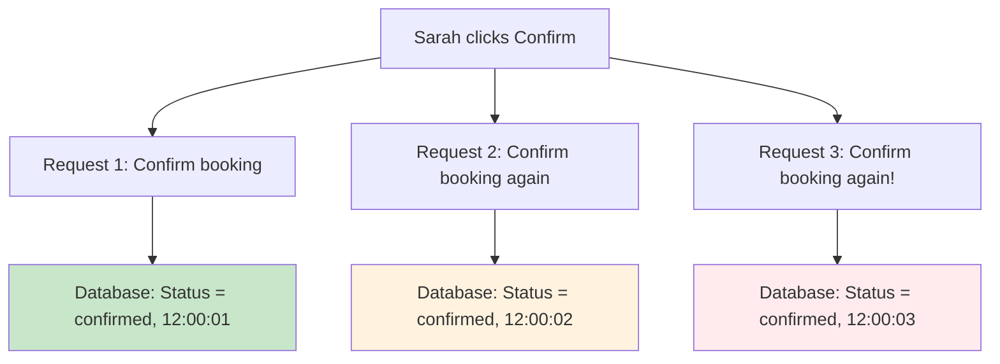

**The Problem:**
- We have 3 "confirmed" records for the same booking
- Which timestamp is the real confirmation time?
- Are these 3 different confirmations or duplicates?

### **Scenario 3: Invalid State Transitions (The Logic Problem)**

Sometimes systems get confused and create impossible scenarios:

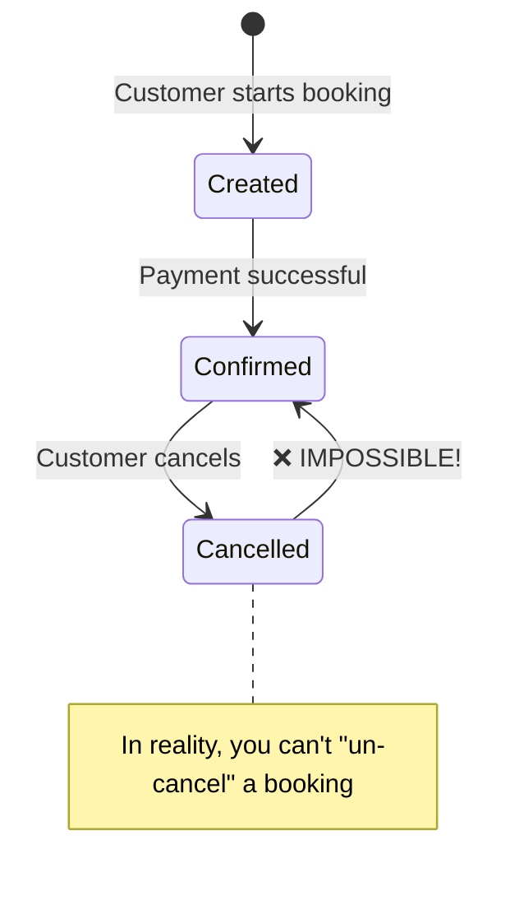

**Real Example:**
```
10:00 AM: BK001, created
12:00 PM: BK001, confirmed
2:00 PM:  BK001, cancelled
3:00 PM:  BK001, confirmed  ← This shouldn't be possible!
```

**Why This Happens:**
- System bugs
- Network delays causing out-of-order processing
- Multiple systems updating the same booking
- Race conditions in code

</details>

---

## 🛠️ **Our Solution Architecture** 🟡

<details>
<summary><strong>🏗️ Bronze → Silver → Gold Architecture (Click to expand)</strong></summary>

We solve these problems using a "medallion architecture" - think of it like a quality control factory:

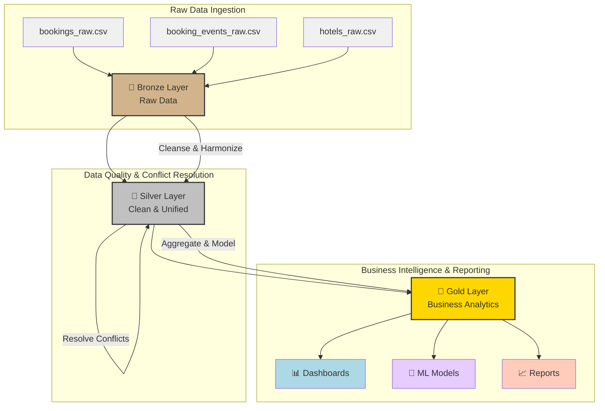

**1. 🥉 Bronze Layer (Raw Data):**
- **Purpose**: Store data exactly as it arrives from sources (like `bookings_raw.csv`, `booking_events_raw.csv`, `hotels_raw.csv`).
- **State**: Unprocessed, potentially messy, duplicates, errors.
- **Analogy**: A raw food delivery truck. We don't touch anything.

**2. 🥈 Silver Layer (Clean & Unified):**
- **Purpose**: Clean, harmonize, and resolve conflicts. Create a single, reliable source of truth.
- **Logic**: Deduplication, schema enforcement, data type correction, conflict resolution (e.g., deciding which timestamp wins).
- **Analogy**: A cleaned, chopped, and prepped ingredient station.
- **Example (Conflict Resolution):**
    - Input: `BK001, confirmed, 12:00:00` (from `bookings_raw`)
    - Input: `BK001, confirmed, 12:05:30` (from `booking_events_raw`)
    - Problem: Which is the *true* confirmation time?
    - Logic: Trust the latest timestamp, or the more reliable source.
    - Steps:
        1. **Detect**: Identify conflicting records
        2. **Prioritize**: Events table is more granular, `booking_events_raw.event_ts` is often more accurate than `bookings_raw.updated_at`.
        3. **Compare**: `12:05:30 PM` > `12:00:00 PM`
        4. **✅ Resolution**: Trust the later timestamp (12:05:30 PM)
        5. **📝 Audit Trail**: Record why we made this choice

**Output (Clean):**
```sql
booking_id: BK001
status: confirmed
final_timestamp: 12:05:30 PM
resolution_method: 'EVENT_OVERRIDE'
confidence_score: 0.95 (high confidence)
```

</details>

---

## 📈 **Business Intelligence & Analytics** 🟡

<details>
<summary><strong>📊 Advanced Analytics & Business Intelligence (Click to expand)</strong></summary>

Once we have clean data, we create insights that help run the business:

### **Daily KPIs Dashboard**

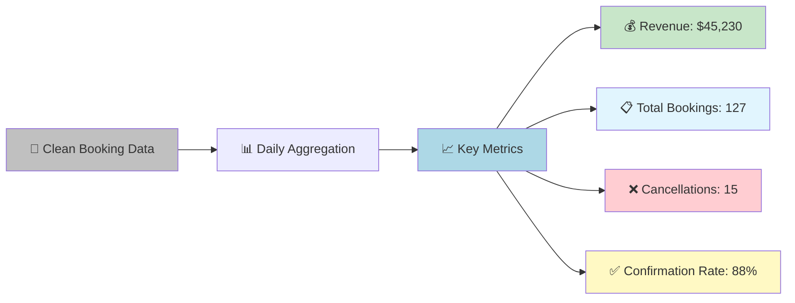

### **Customer Behavior Analytics**

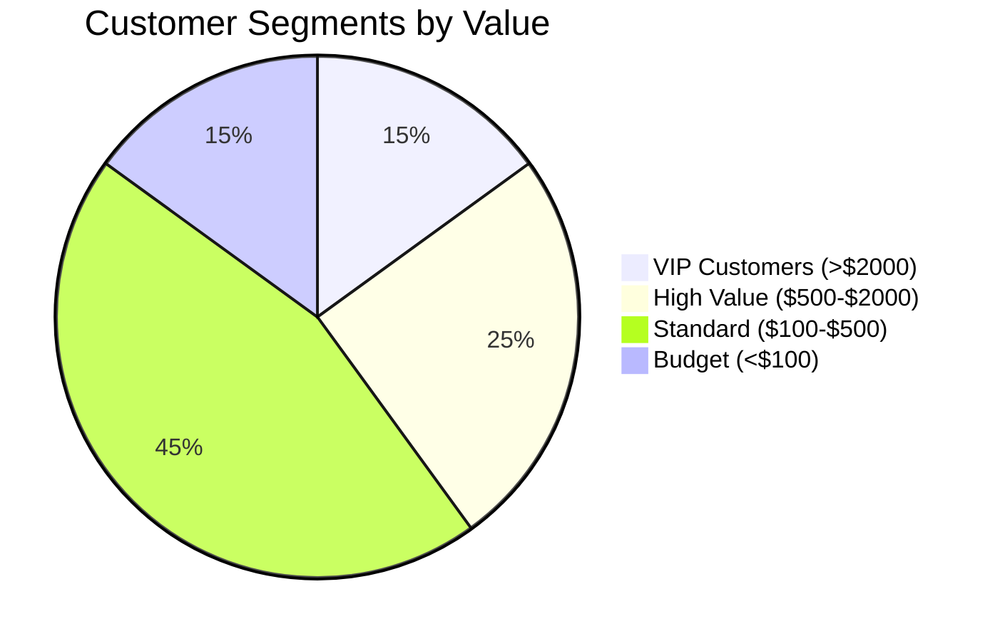

**Customer Risk Analysis:**
- **🟢 Low Risk**: Books regularly, rarely cancels
- **🟡 Medium Risk**: Hasn't booked in 3 months  
- **🔴 High Risk**: High cancellation rate, might churn

### **Hotel Partnership Scoring**

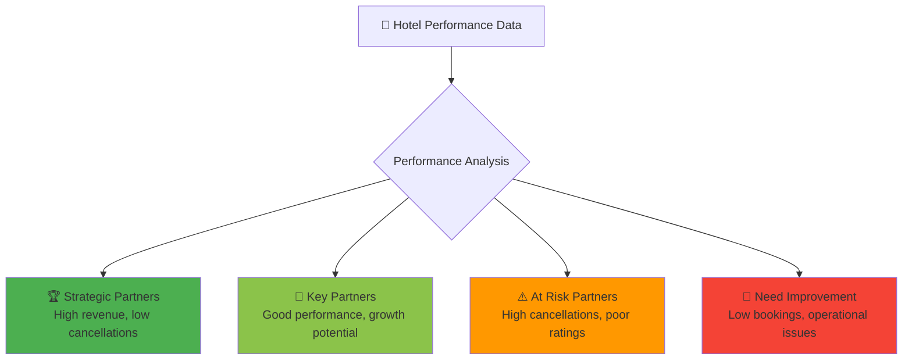

</details>

---

## 🎯 **Critical Points & Corner Cases** 🔴

<details>
<summary><strong>🎯 Overview: Critical Points & Advanced Scenarios (Click to expand)</strong></summary>

**📋 What You'll Learn:**
- **🔴 Critical Points 1-3**: Foundational concepts (Revenue, Late Data, State Transitions)
- **🔴 Critical Points 4-11**: Advanced Travel Industry Scenarios
  - 🔥 Critical Point 4: The Simultaneous Confirmation Problem
  - 🐌 Critical Point 5: The Hotel System Delay Nightmare
  - 💸 Critical Point 6: The Payment Gateway Time Warp
  - 🌍 Critical Point 7: The Time Zone Confusion Chaos
  - 🏨 Critical Point 8: The Overbooking Disaster
  - 📱 Critical Point 9: The Mobile App Offline/Online Sync
  - 🔄 Critical Point 10: The System Failover Duplicate Event
  - 🤖 Critical Point 11: The Fraud Detection False Positive

**🎯 Each Advanced Scenario Includes:**
- **🛡️ Technical Resolution Strategy**: Descriptive solutions, architecture patterns
- **📱 Sales App UX Strategy**: Customer experience design, communication
- **📊 Data Analytics Strategy**: Monitoring, optimization, ROI analysis

---

</details>

</br>
<details>
<summary><strong>💰 Critical Point 1: Revenue Recognition (Click to expand)</strong></summary>


### **Critical Point 1: Revenue Recognition**

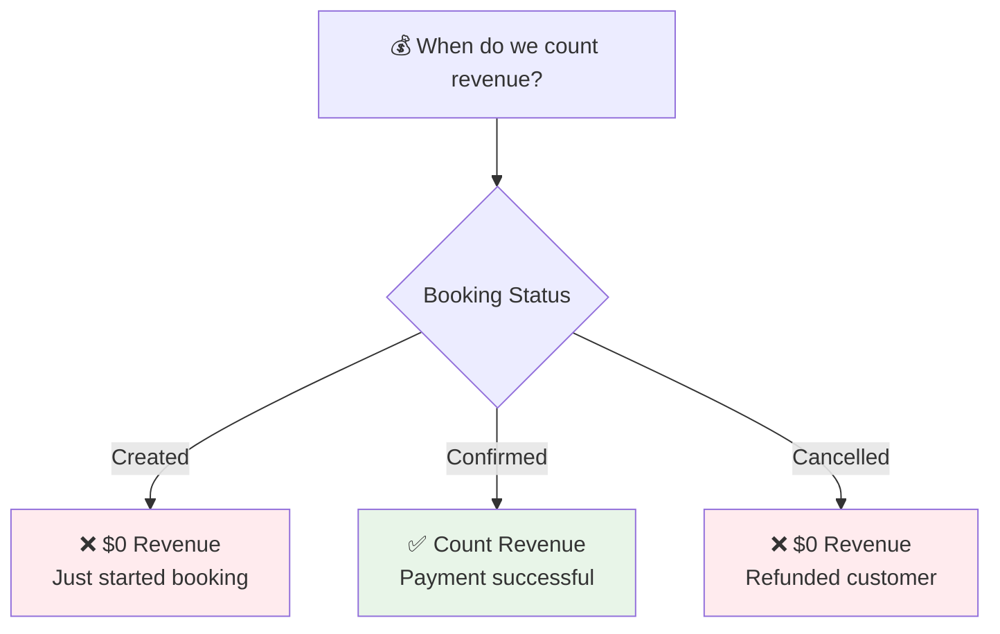

**Why This Matters:**
- **Wrong approach**: Count all bookings as revenue → Overstated financials
- **Right approach**: Only confirmed bookings → Accurate business performance

</details>

</br>
<details>
<summary><strong>⏰ Critical Point 2: Late Data Handling (Click to expand)</strong></summary>


### **Critical Point 2: Late Data Handling**

**Example: The Weekend Problem**
```
Friday 6 PM:   Customer books hotel (BK001, created)
Friday 6:30 PM: Payment fails due to bank issues  
Monday 9 AM:   Payment finally processes
Monday 9:05 AM: Late event arrives: (BK001, confirmed, Friday 6:30 PM)
```

**Challenge:** Do we report this revenue on Friday or Monday?
**Our Solution:** Use event timestamp (Friday) but flag as late-arriving data

</details>

</br>
<details>
<summary><strong>🚫 Critical Point 3: Impossible State Transitions (Click to expand)</strong></summary>


### **Critical Point 3: Impossible State Transitions**

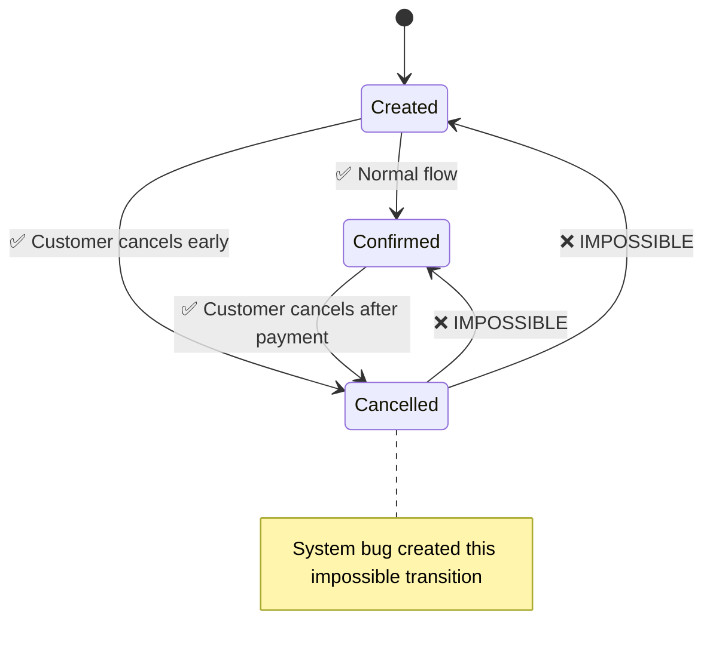

**Our Solution:**
1. **Detect** impossible transitions
2. **Flag** for manual review
3. **Apply** business logic to correct
4. **Audit** trail for compliance

</details>

</br>
<details>
<summary><strong>🔥 Critical Point 4: The Simultaneous Confirmation Problem (Click to expand)</strong></summary>


### **Critical Point 4: The Simultaneous Confirmation Problem**

**Scenario:** Customer gets impatient and clicks "Confirm" on multiple devices simultaneously.

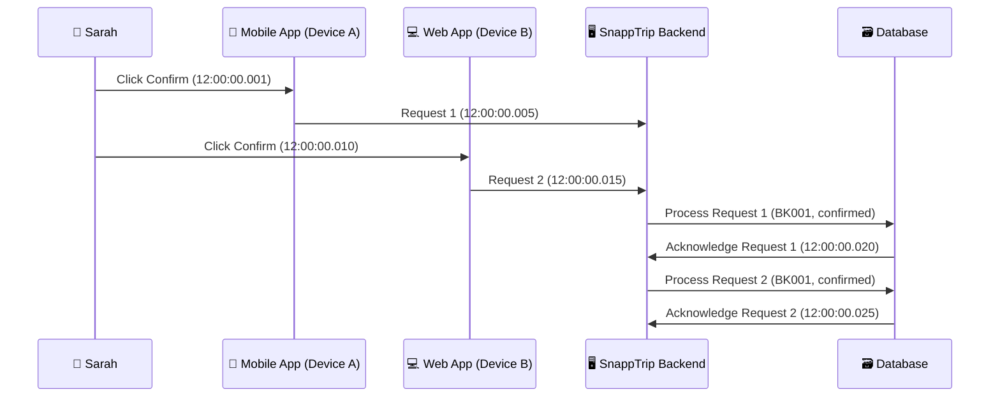

**Data Result:**
```
12:00:00.001: BK001, confirmed, success
12:00:00.001: BK001, confirmed, failed
```

**Our Handling:** Use microsecond-level timestamps + sequence numbers to detect true duplicates vs. legitimate rapid events.

#### **🎯 Best Practice Approaches:**

<details>
<summary><strong>💡 How We Solve It (Current Implementation) - Click to expand</strong></summary>

##### **💡 How We Solve It (Current Implementation)**

**Implementation Details (from `sql/silver/bookings_silver.sql`):**
- **Duplicate Event Detection**: The `event_state_transitions` CTE (lines 92-99) identifies `potential_duplicate_event` when the same `event_type` occurs within **5 minutes** for the same `booking_id`. This is a time-based heuristic.
- **Resolution Logic**: In the `comprehensive_booking_analysis` CTE, Rule 4 (line 166) specifies: `WHEN e.potential_duplicate_event = 1 THEN b.bookings_status`. This means if a potential duplicate event is detected, the system prefers the status from the `bookings_raw` table (which is considered the main booking record).
- **Authoritative Timestamp**: When a `potential_duplicate_event` is detected, the `authoritative_timestamp` also defaults to `b.updated_at` from the `bookings_raw` table (line 179).
- **Confidence Scoring**: A `resolution_confidence` of `0.7` (medium-low) is assigned when a duplicate is detected (line 187).

**Limitations Based on Tutorial's Ideal Solution:**
- **No Idempotency Keys**: The current implementation does not use explicit idempotency keys (e.g., UUIDs generated at the client) to uniquely identify and deduplicate requests across systems.
- **Time-Based Heuristic**: Deduplication relies solely on a 5-minute time window, which is a heuristic and might not catch all true duplicates or differentiate them from legitimate rapid events.
- **No Microsecond Timestamps for Deduplication**: The solution doesn't explicitly use microsecond-level timestamps for highly precise duplicate detection as suggested in the tutorial.
- **No Device Fingerprinting**: The implementation does not distinguish between multi-device vs. multi-click scenarios.

</details>

<details>
<summary><strong>🛡️ Technical Resolution Strategy (Click to expand)</strong></summary>

##### **🛡️ Technical Resolution Strategy**

**Core Solution Approaches:**
- **Idempotency Keys**: Generate unique request IDs for each click to prevent duplicate processing
- **Database Locks**: Use optimistic locking on booking records to ensure atomic operations
- **Circuit Breakers**: Prevent cascade failures from duplicate processing overload
- **Microsecond Timestamps**: Detect true duplicates vs. legitimate rapid events with high precision
- **Device Fingerprinting**: Distinguish between multi-device vs. multi-click scenarios
- **Request Deduplication**: Advanced logic to classify simultaneous requests as legitimate or duplicate
- **Audit Trails**: Comprehensive logging of all attempts with resolution reasoning for compliance

**Technical Architecture:**
- **Queue-based Processing**: Buffer simultaneous requests to prevent race conditions
- **Distributed Locking**: Coordinate across multiple servers using Redis or similar
- **Timeout Mechanisms**: Prevent requests from hanging indefinitely during conflicts
- **Rollback Procedures**: Clean recovery when duplicate detection fails

</details>

<details>
<summary><strong>📱 Sales App UX Strategy (Click to expand)</strong></summary>

##### **📱 Sales App UX Strategy**

**Customer Experience Solutions:**
- **Visual Feedback**: Immediate button state change (disabled with spinner) to show action is registered
- **Progress Communication**: Clear status messages like "Confirming with hotel..." to set expectations
- **Timeout Handling**: Transparent messaging if confirmation takes longer than 30 seconds
- **Cross-Device Synchronization**: Real-time status updates across all customer's logged-in devices
- **Error Recovery**: Clear, actionable paths to retry booking if technical issues occur

**User Interface Design:**
- **Loading States**: Intuitive visual cues that booking is in progress
- **Confirmation Feedback**: Immediate acknowledgment that request was received
- **Status Transparency**: Real-time updates on booking processing status
- **Alternative Actions**: Options to cancel or modify during processing if appropriate
- **Success Communication**: Clear confirmation with booking details when completed
- **Failure Handling**: Empathetic error messages with next steps and support contact

</details>

<details>
<summary><strong>📊 Data Analytics Strategy (Click to expand)</strong></summary>

##### **📊 Data Analytics Strategy**

**Performance Analytics:**
- **Customer Behavior Patterns**: Identify impatient users vs. confused users to tailor experiences
- **UX Optimization Metrics**: Measure button click patterns and timing to improve interface design
- **System Performance Tracking**: Monitor duplicate processing overhead and resource consumption
- **A/B Testing Framework**: Compare effectiveness of different loading states and UI approaches
- **Fraud Detection Training**: Use behavioral patterns to enhance fraud detection algorithms

**Business Intelligence:**
- **Behavioral Classification**: Segment users by multi-device vs. single-device spam patterns
- **Success Rate Analysis**: Track booking completion rates across different behavior types
- **Resource Impact Assessment**: Calculate costs of duplicate processing and prevention systems
- **User Experience Correlation**: Link customer satisfaction scores to simultaneous confirmation incidents
- **ROI Measurement**: Quantify business value of implementing duplicate prevention systems

**Predictive Analytics:**
- **Risk Scoring**: Predict likelihood of simultaneous confirmations based on user history
- **Load Forecasting**: Anticipate peak periods of duplicate requests for capacity planning
- **Customer Segmentation**: Identify high-risk users who frequently trigger duplicate scenarios
- **System Optimization**: Recommend infrastructure improvements based on usage patterns

</details>
</details>
</details>
</details>
</details>

</br>
<details>
<summary><strong>🐌 Critical Point 5: The Hotel System Delay Nightmare (Click to expand)</strong></summary>


### **Critical Point 5: The Hotel System Delay Nightmare**

**Scenario:** Hotel partner's system is slow to respond, causing confirmation delays.

```mermaid
gantt
    title Hotel Response Delay Timeline
    dateFormat HH:mm:ss
    axisFormat %H:%M:%S
    
    section Customer Journey
    Clicks Confirm    :done, customer, 12:00:00, 12:00:01
    
    section SnappTrip System
    Processes Request :done, snapp, 12:00:01, 12:00:02
    Waits for Hotel   :active, wait, 12:00:02, 12:05:00
    
    section Hotel System
    Receives Request  :crit, hotel_receive, 12:00:05, 12:00:06
    Processes Booking :active, hotel_process, 12:00:06, 12:04:00
    Sends Confirmation:done, hotel_confirm, 12:04:00, 12:04:01
    
    section Conflict Resolution
    Detects Conflict  :crit, conflict_detect, 12:04:01, 12:04:02
    Applies Rule      :active, rule_apply, 12:04:02, 12:04:05
    
    section Parallel User Action
    Gets Frustrated   :crit, frustration, 12:01:00, 12:04:30
    Tries to Cancel   :active, cancel, 12:03:00, 12:03:01
```

**What Happens:**
```
12:00:00: Customer clicks confirm
12:00:01: SnappTrip sends request to hotel
12:03:00: Customer gets worried, tries to cancel
12:05:00: Hotel finally responds: "Confirmed!"
12:05:01: Conflict! Confirmation vs Cancellation
```

**Our Solution:** Implement timeouts and handle late confirmations with business rules (e.g., honor confirmation if < 10 minutes late).

<details>
<summary><strong>💡 How We Solve It (Current Implementation) - Click to expand</strong></summary>

##### **💡 How We Solve It (Current Implementation)**

**Implementation Details (from `sql/silver/bookings_silver.sql`):**
- **Generic Conflict Resolution Rules**: The `comprehensive_booking_analysis` CTE (lines 158-171) includes rules that attempt to resolve conflicts between `bookings_status` (from `bookings_raw`) and `events_status` (from `booking_events_raw`).
- **Time-Based Prioritization**: 
    - **Rule 2 (lines 161-162, 176-177)**: If an `event_ts` is more recent than `b.updated_at` by more than **30 minutes**, the system trusts the `events_status` and `e.event_ts`. This could *partially* address a very late hotel confirmation.
    - **Rule 3 (lines 163-164, 178-179)**: If `b.updated_at` is more recent than `e.event_ts` by more than **5 minutes**, the system trusts `b.bookings_status` and `b.updated_at`. This helps if the booking system has a more up-to-date status due to internal processing.
- **No Specific "Hotel Delay" Logic**: The resolution logic is generic and does not explicitly distinguish or handle "hotel system delays" as a specific scenario. There are no mechanisms for tiered timeouts, circuit breakers for hotel APIs, or specific rules like "honor confirmation if < 10 minutes late" as described in the tutorial's ideal solution.

**Limitations Based on Tutorial's Ideal Solution:**
- **No Tiered Timeouts**: The current SQL does not implement variable timeouts based on hotel performance.
- **No Circuit Breaker Pattern**: There is no logic to temporarily bypass or degrade service for consistently slow hotel partners.
- **No Multi-Endpoint Failover**: The current implementation does not route to backup hotel system endpoints.
- **No Proactive Alternative Offering**: The backend logic does not proactively identify or suggest alternative hotels during delays.
- **No Specific Late Confirmation Handling**: While there are time-based rules, they are not specifically tailored to "honor confirmation if < 10 minutes late" or similar nuanced business rules for hotel delays.

</details>

#### **🎯 Best Practice Approaches:**

<details>
<summary><strong>🛡️ Technical Resolution Strategy (Click to expand)</strong></summary>

##### **🛡️ Technical Resolution Strategy**

**Core Solution Approaches:**
- **Tiered Timeout Strategy**: Different time limits based on hotel tier and historical performance (Premium: 45s, Standard: 30s, Budget: 20s)
- **Circuit Breaker Pattern**: Temporarily bypass consistently slow hotels during peak periods to maintain system performance
- **Multi-Endpoint Failover**: Automatic retry using backup hotel system endpoints when primary systems timeout
- **SLA Monitoring & Penalties**: Real-time tracking of hotel response times with contract enforcement mechanisms
- **Guaranteed Booking System**: Partial confirmation process that secures reservation even during hotel system delays
- **Queue-Based Retry Logic**: Smart queuing for delayed requests during off-peak hours to maximize success rates

**Architecture Components:**
- **Timeout Management**: Progressive escalation based on hotel performance tiers and reliability scores
- **Alternative Suggestion Engine**: Real-time identification of similar available hotels when delays occur
- **Backup Communication Channels**: Multiple pathways to reach hotel systems for maximum reliability
- **Load Balancing**: Distribute requests across hotel system endpoints to prevent overload
- **Performance Monitoring**: Continuous tracking of hotel system responsiveness with alerting
- **Business Rule Engine**: Automated decisions for late confirmations based on time delays and customer context

</details>

<details>
<summary><strong>📱 Sales App UX Strategy (Click to expand)</strong></summary>

##### **📱 Sales App UX Strategy**

**Customer Communication Strategy:**
- **Progressive Disclosure**: Gradually reveal booking status updates to keep customers informed without overwhelming them
- **Realistic Expectation Setting**: Display accurate time estimates based on historical hotel response patterns
- **Proactive Alternative Offering**: Present similar available hotels after 30-45 seconds to reduce abandonment
- **Transparent Status Communication**: Clear explanations like "Hotel system is busy" instead of generic loading messages
- **Customer Control**: Empower users to choose between waiting for original hotel or switching to alternatives

**User Interface Design:**
- **Status Timeline**: Visual progress indicator showing current step in confirmation process
- **Smart Messaging**: Context-aware messages that evolve based on delay duration
- **Alternative Hotel Display**: Clean, comparable options with key differences highlighted
- **Action Options**: Clear buttons for "Keep Waiting" vs. "Choose Alternative" with no pressure
- **Fallback Communication**: Graceful handling when delays exceed reasonable timeframes
- **Mobile-Optimized**: Responsive design that works well during travel scenarios

</details>

<details>
<summary><strong>📊 Data Analytics Strategy (Click to expand)</strong></summary>

##### **📊 Data Analytics Strategy**

**Performance Analytics:**
- **Hotel Performance Tiers**: Classify hotels by response reliability and speed (A-Tier: <10s, B-Tier: <20s, C-Tier: <40s)
- **Peak Hour Analysis**: Identify when specific hotels are slowest to optimize timeout settings
- **Seasonal Performance Patterns**: Track hotel system performance during holidays, events, and high-traffic periods
- **SLA Compliance Monitoring**: Measure contract adherence and identify penalty situations
- **Revenue Impact Assessment**: Calculate bookings lost due to delays and quantify financial impact

**Operational Intelligence:**
- **Timeout Optimization**: Data-driven recommendations for hotel-specific timeout thresholds
- **Circuit Breaker Triggers**: Analytics to determine when to temporarily bypass slow hotels
- **Alternative Recommendation Engine**: Performance data to rank similar hotels for customer alternatives
- **Load Distribution**: Optimize request routing based on hotel system capacity and response patterns

**Business Intelligence:**
- **Partner Negotiations**: Use performance data for contract renewals and rate negotiations  
- **Cost-Benefit Analysis**: ROI of implementing advanced timeout and failover systems
- **Customer Satisfaction Correlation**: Link hotel response delays to customer satisfaction scores
- **Predictive Modeling**: Forecast hotel system performance based on historical patterns and external factors

</details>
</details>
</details>
</details>
</details>

</br>
<details>
<summary><strong>💸 Critical Point 6: The Payment Gateway Time Warp (Click to expand)</strong></summary>


### **Critical Point 6: The Payment Gateway Time Warp**

**Scenario:** Payment processing has delays due to bank fraud checks.

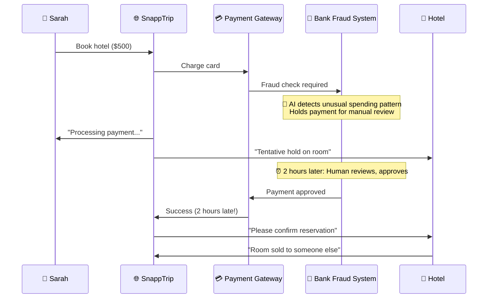

**Data Timeline:**
```
14:00: BK001, created
14:01: Payment request sent
14:02: Payment status: Pending Fraud Review
16:00: Bank approves payment (2 hours later)
16:01: Payment Gateway reports SUCCESS
16:02: SnappTrip tries to confirm room with hotel
16:03: Hotel responds: "Room no longer available"
```

**Our Solution:** Implement strict payment timeouts, offer alternative rooms proactively, and use payment idempotency to prevent double charges if retry happens.

<details>
<summary><strong>💡 How We Solve It (Current Implementation) - Click to expand</strong></summary>

##### **💡 How We Solve It (Current Implementation)**

**Implementation Details (from `sql/silver/bookings_silver.sql` and `data/`):**
- **Not Covered by Current Implementation**: The current data model (`bookings_raw`, `booking_events_raw`, `hotels_raw`) and the SQL pipeline (`bookings_silver.sql`) do not include explicit support for payment processing details, payment gateway interactions, or fraud review statuses.
- **Data Limitations**: There are no dedicated columns in the raw data to track payment `transaction_id`, `payment_status`, `fraud_check_result`, or `payment_gateway_response_time`.
- **Logic Limitations**: Consequently, the `bookings_silver.sql` does not contain any logic for:
    - Implementing payment-specific timeouts.
    - Handling asynchronous payment events or webhooks.
    - Implementing idempotency keys for payment transactions.
    - Offering alternative rooms based on payment delays.

**Reasoning for Non-Coverage:**
- The current schema focuses on booking and event statuses at a high level. Integrating detailed payment gateway interactions would require additional raw data sources (e.g., `payments_raw` table) and corresponding Spark SQL logic to process these events and resolve conflicts.

</details>

#### **🎯 Best Practice Approaches:**

<details>
<summary><strong>🛡️ Technical Resolution Strategy (Click to expand)</strong></summary>

##### **🛡️ Technical Resolution Strategy**

**Core Solution Approaches:**
- **Idempotency Keys**: Generate unique transaction IDs to prevent double charges during retries or multiple attempts due to payment gateway delays or system failures.
- **Asynchronous Processing**: Utilize webhooks or long-polling mechanisms to handle external fraud checks and payment finalization without blocking the user interface.
- **Tiered Timeouts**: Implement different timeout thresholds for various stages of payment processing (e.g., initial request vs. fraud review) to optimize response handling.
- **Multi-Gateway Failover**: Automatically switch to an alternative payment gateway if the primary one experiences delays or failures, ensuring business continuity.
- **Transaction Rollback/Compensation**: Implement clear procedures to refund or cancel tentative bookings if payment ultimately fails or times out after a delay.
- **Payment Tokenization**: Securely store card details using tokenization to minimize PCI compliance scope and enhance security, without exposing raw data.

**Architecture Components:**
- **Payment Orchestration Layer**: A dedicated service to manage interactions with multiple payment gateways and abstract complexity.
- **Event-Driven Architecture**: Use message queues (e.g., Kafka, RabbitMQ) to handle asynchronous payment events and decoupled processing.
- **Distributed Tracing**: Implement comprehensive tracing to monitor payment requests across all integrated systems and identify bottlenecks.
- **Fraud Management System Integration**: Seamlessly connect with internal or external fraud detection systems for real-time risk assessment.
- **Retry Mechanisms with Exponential Backoff**: Intelligent retry logic for transient payment errors with increasing delays between attempts.
- **Reconciliation Services**: Automated processes to match payments with bookings and identify discrepancies, especially after delays.

</details>

<details>
<summary><strong>📱 Sales App UX Strategy (Click to expand)</strong></summary>

##### **📱 Sales App UX Strategy**

**Customer Communication Strategy:**
- **Transparent Status**: Clearly communicate payment status (e.g., "Processing securely," "Pending fraud review," "Payment successful," "Payment failed").
- **Expectation Setting**: Inform users about potential delays due to security checks or bank processing times with realistic timeframes.
- **Proactive Alternatives**: Offer alternative hotels or actions (e.g., try another payment method) if payment is significantly delayed and a room hold is expiring.
- **Idempotent UI**: Design the user interface to prevent users from re-submitting payment if a transaction is already in progress, to avoid confusion and double charges.
- **Secure Messaging**: Reassure users through clear, concise messages that their personal and payment data is secure during the processing phase.
- **Clear Calls to Action (CTAs)**: Provide actionable options like "Check Latest Status," "Browse Other Hotels," or "Contact Support" during payment delays.

**User Interface Design:**
- **Progress Indicators**: Animated spinners or progress bars with accompanying text to show that the system is actively working on the payment.
- **Contextual Information**: Display relevant details about the booking and payment attempt, including any temporary room holds.
- **Error/Delay Modals**: Design clear and empathetic modals or pop-ups for payment delays or failures, explaining the issue and offering solutions.
- **Time-Sensitive Alerts**: Use visual cues or notifications if a room hold is about to expire due to payment delays.
- **Payment Method Flexibility**: Allow users to easily switch to alternative payment methods if one is failing or delayed.
- **Confirmation of Idempotency**: If a user attempts to resubmit, clearly state that the original transaction is still processing or has been handled, preventing confusion.

</details>

<details>
<summary><strong>📊 Data Analytics Strategy (Click to expand)</strong></summary>

##### **📊 Data Analytics Strategy**

**Performance Analytics:**
- **Payment Delay Root Causes**: Analyze transaction logs to identify the most frequent causes of payment delays (e.g., specific payment gateways, banks, high-risk transactions).
- **Revenue Impact Assessment**: Quantify the actual and potential revenue lost due to payment delays, including abandoned bookings and unrecoverable charges.
- **Customer Satisfaction Correlation**: Correlate payment delay lengths with customer satisfaction scores and support ticket volumes to understand the UX impact.
- **Conversion Rate Analysis**: Track how different types and durations of payment delays affect booking completion rates and overall conversion funnels.
- **Payment Partner Performance**: Evaluate the SLA compliance and overall reliability of each payment gateway partner, identifying underperforming providers.

**Operational Intelligence:**
- **Fraud Review Time Optimization**: Analyze the duration of manual fraud reviews to identify bottlenecks and areas for process improvement.
- **Delay Trend Identification**: Detect seasonal or peak-hour trends in payment delays to proactively adjust operational strategies.
- **Automated Alerting**: Set up real-time alerts for unusual spikes in payment failures or delays, enabling rapid response from operations teams.
- **Reconciliation Discrepancy Tracking**: Monitor the frequency and types of reconciliation issues arising from payment delays.
- **Alternative Payment Method Effectiveness**: Track the usage and success rates of alternative payment methods offered during delays.

**Business Intelligence:**
- **Cost-Benefit Analysis**: Evaluate the ROI of implementing advanced payment retry, multi-gateway, and fraud detection systems.
- **Customer Lifetime Value (CLV) Impact**: Assess how payment friction affects customer loyalty and long-term value.
- **Geographic Payment Patterns**: Identify regional differences in payment success rates and delay frequencies.
- **Product Optimization**: Provide data-driven recommendations for improving the payment flow, optimizing fraud thresholds, and enhancing security features.

</details>
</details>
</details>
</details>
</details>

</br>
<details>
<summary><strong>🌍 Critical Point 7: The Time Zone Confusion Chaos (Click to expand)</strong></summary>


### **Critical Point 7: The Time Zone Confusion Chaos**

**Scenario:** Global travel system with bookings across time zones. Customer confirms at 3 PM local time, but database records UTC. Hotel confirms at 9 AM their local time, but it's 5 PM for customer.

```mermaid
sequenceDiagram
    participant Customer as 👤 Sarah (New York, EST)
    participant SnappTrip as 🌐 SnappTrip (UTC)
    participant Hotel as 🏨 Hotel (Paris, CET)
    
    Note over Customer,Hotel: Sarah books a hotel in Paris
    
    Customer->>SnappTrip: Book Hotel in Paris (10:00 AM EST) --> 15:00 UTC
    SnappTrip->>Hotel: Request Confirmation (15:00 UTC) --> 16:00 CET
    
    Note over Hotel: Hotel confirms at 9:00 AM CET (next day)
    
    Hotel->>SnappTrip: Confirmation (09:00 AM CET) --> 08:00 UTC (next day)
    SnappTrip->>Customer: Booking Confirmed! (08:00 AM UTC) --> 03:00 AM EST (next day)
    
    Note over Customer: Sarah wakes up, sees 3 AM EST confirmation for 10 AM EST booking
```

**Data Timeline:**
```
Customer (New York - EST, UTC-5):
  Booking time: 10:00 AM EST (Jan 1)
  Confirmation time: 03:00 AM EST (Jan 2)

SnappTrip (UTC):
  Booking time: 15:00 UTC (Jan 1)
  Confirmation time: 08:00 UTC (Jan 2)

Hotel (Paris - CET, UTC+1):
  Booking time: 16:00 CET (Jan 1)
  Confirmation time: 09:00 AM CET (Jan 2)

Conflict: Customer sees 3 AM confirmation for a booking made at 10 AM yesterday.
```

**Our Solution:** Store all timestamps in UTC, but always display in the relevant local timezone (customer's or hotel's) with clear labels.

<details>
<summary><strong>💡 How We Solve It (Current Implementation) - Click to expand</strong></summary>

##### **💡 How We Solve It (Current Implementation)**

**Implementation Details (from `run_pipeline.py` and `sql/silver/bookings_silver.sql`):**
- **Not Covered by Current Implementation**: The current implementation does not include any explicit timezone handling, UTC normalization, or local timezone conversion.
- **Data Limitations**: The raw data files (`bookings_raw.csv`, `booking_events_raw.csv`) store timestamps as strings (e.g., "yyyy-MM-dd HH:mm:ss") without any timezone information. The `hotels_raw.csv` also does not contain hotel-specific timezone data.
- **Logic Limitations**:
    - `run_pipeline.py` reads timestamps using `timestampFormat="yyyy-MM-dd HH:mm:ss"` (line 144) but does not perform any timezone conversions.
    - The Spark SQL queries in `bookings_silver.sql` and subsequent Gold layer SQL files process these timestamps as-is, implicitly assuming they are in a consistent (likely local) timezone or without needing explicit conversion for current calculations (e.g., `DATEDIFF`).
    - There is no logic for detecting a user's or hotel's timezone, or for displaying timestamps in a user-friendly local format with labels.

**Reasoning for Non-Coverage:**
- Implementing robust timezone handling would require either:
    - Enriching the raw data with timezone information (e.g., `customer_timezone`, `hotel_timezone`).
    - Implementing a dedicated timezone service or library in the Python/Spark code to perform conversions.
- The current schema and logic are simplified for the core data flow demonstration and do not extend to global timezone management.

</details>

#### **🎯 Best Practice Approaches:**

<details>
<summary><strong>🛡️ Technical Resolution Strategy (Click to expand)</strong></summary>

##### **🛡️ Technical Resolution Strategy**

**Core Solution Approaches:**
- **UTC Normalization**: All timestamps from various sources (customer, hotel, internal systems) are immediately converted and stored in Coordinated Universal Time (UTC) within the database. This eliminates ambiguity and provides a single reference point for all time-based operations.
- **Multi-Signal Timezone Detection**: Implement robust logic to infer the most accurate timezone context. This involves considering multiple signals such as the user's IP address, browser locale settings, explicit user preferences in their profile, and the geographical location of the hotel.
- **Standardized Time Libraries**: Utilize battle-tested timezone libraries in all backend services (e.g., `pytz` in Python, `moment-timezone` in JavaScript) for accurate conversion between UTC and local timezones, including handling daylight saving changes.
- **ISO 8601 Compliance**: Ensure all timestamp exchanges between internal and external systems adhere to the ISO 8601 standard (`YYYY-MM-DDTHH:MM:SSZ`). This guarantees interoperability and avoids misinterpretations.
- **Granular Audit Logs**: Maintain detailed audit logs that record the original timestamp as received, the inferred local timezone, and the final UTC-normalized timestamp. This is crucial for debugging, dispute resolution, and regulatory compliance.

**Architecture Components:**
- **Timezone Service**: A dedicated microservice or library responsible for all timezone conversions and inference logic.
- **Data Ingestion Pipelines**: Automated processes that perform UTC normalization as the first step when data enters the Bronze layer.
- **API Gateway**: Enforce standardized timestamp formats for all incoming and outgoing API calls.
- **Configuration Management**: Centralized management of timezone rules and exceptions, especially for partners with non-standard handling.
- **Database Schema**: Ensure database columns are of `TIMESTAMP WITH TIME ZONE` or similar types where supported, or explicitly store UTC timestamps.
- **Distributed Clock Synchronization**: Regularly synchronize system clocks across all servers to prevent internal time drifts that could exacerbate timezone issues.

</details>

<details>
<summary><strong>📱 Sales App UX Strategy (Click to expand)</strong></summary>

<details>
<summary><strong>📱 Sales App UX Strategy (Click to expand)</strong></summary>

##### **📱 Sales App UX Strategy**

**Customer Experience Solutions:**
- **Default to Local Time**: Display all booking-related times (creation, confirmation, check-in/out) in the user's detected local timezone by default, reducing immediate cognitive load.
- **Clear Timezone Labels**: Always append explicit timezone abbreviations (e.g., EST, CET, UTC) to all displayed timestamps to avoid ambiguity.
- **Hover for UTC/Other Timezones**: Implement tooltips or small pop-overs on timestamps that, when hovered, reveal the equivalent time in UTC or the hotel's local timezone.
- **User-Configurable Timezone**: Provide an option in user settings to allow customers to manually set their preferred display timezone, catering to frequent travelers or those managing bookings for others.
- **Contextual Clarity and Explanation**: If there's a significant difference between the user's and the hotel's timezone, include a brief, reassuring explanation directly in the UI (e.g., "Hotel confirmed at [time] local hotel time").
- **Comprehensive Confirmation Emails**: Ensure all booking confirmation emails and notifications include key timestamps in at least three formats: user's local time, hotel's local time, and UTC, clearly labeled.

**User Interface Design:**
- **Dual Timezone Display**: For critical events like check-in/out, display both the user's local time and the hotel's local time prominently.
- **Interactive Time Selectors**: When users are inputting times (e.g., desired check-in), provide intuitive controls that clearly show the chosen time in multiple timezones.
- **Dynamic Maps/Visualizations**: For international bookings, use interactive maps or visual timelines that illustrate the time difference between the user's location and the hotel's location.
- **Timezone Change Warnings**: Alert users if their detected timezone changes mid-session or if a booking's timezone doesn't match their typical travel patterns.
- **Booking Summary Review**: Include a dedicated section in the booking review page that summarizes all relevant times and their respective timezones before final confirmation.
- **Simplified Date/Time Pickers**: Use calendar widgets that automatically adjust for timezones when selecting dates and times.

</details>

<details>
<summary><strong>📊 Data Analytics Strategy (Click to expand)</strong></summary>

##### **📊 Data Analytics Strategy**

**Performance Analytics:**
- **Timezone Confusion Hotspots**: Identify specific user-hotel timezone pairs or geographic regions that most frequently lead to confusion or booking discrepancies.
- **Financial Impact of Confusion**: Calculate potential revenue loss from abandoned bookings, cancellations, or customer service costs directly attributable to timezone confusion.
- **Customer Service Load Analysis**: Track the volume of support tickets and customer complaints related to time discrepancies, categorizing by type of confusion.
- **No-Show/Late Arrival Correlation**: Analyze if bookings with high timezone confusion risk have a higher rate of no-shows or late arrivals.
- **UX Feature Effectiveness**: Measure the impact of timezone clarity features (e.g., dual display, tooltips) on customer satisfaction, conversion rates, and reduction in support inquiries.

**Operational Intelligence:**
- **Timezone Data Quality Monitoring**: Implement dashboards to monitor the accuracy of inferred timezones and identify missing or inconsistent timezone data points.
- **DST Transition Impact Analysis**: Track booking behavior and system events around Daylight Saving Time (DST) transitions to detect and prevent related issues.
- **Multi-Signal Detection Accuracy**: Evaluate the effectiveness of different timezone inference signals (IP, browser, user profile) to continuously improve accuracy.
- **Alerting for Discrepancies**: Set up automated alerts for significant or unusual timezone discrepancies that could indicate data quality problems.

**Business Intelligence:**
- **Product Development Feedback**: Provide data-driven insights to product teams for enhancing timezone-related features and user experience.
- **Global Market Expansion Strategy**: Understand timezone-specific challenges and preferences to inform market expansion efforts.
- **Customer Segmentation**: Segment customers based on their propensity for timezone-related issues to tailor communications and support.
- **Operational Efficiency**: Identify opportunities to streamline processes by reducing manual intervention required for timezone-related issues.

</details>
</details>
</details>
</details>

</br>
<details>
<summary><strong>🏨 Critical Point 8: The Overbooking Disaster (Click to expand)</strong></summary>


### **Critical Point 8: The Overbooking Disaster**

**Scenario:** Hotel accepts more bookings than rooms available. Customer arrives and finds no room.

```mermaid
sequenceDiagram
    participant Customer as 👤 Sarah
    participant SnappTrip as 🌐 SnappTrip
    participant Hotel as 🏨 Hotel (Inventory System)
    
    Note over Customer: Sarah books last room at 10:00 AM
    Customer->>SnappTrip: Book Hotel A
    SnappTrip->>Hotel: Request room for Sarah
    Hotel->>SnappTrip: Confirm room for Sarah (Capacity: 1/1)
    SnappTrip->>Customer: Booking Confirmed!
    
    Note over Customer: John books same last room at 10:00:05 AM (due to delay in sync)
    Customer->>SnappTrip: Book Hotel A (John)
    SnappTrip->>Hotel: Request room for John
    Hotel->>SnappTrip: Confirm room for John (Capacity: 2/1) -- ERROR in system!
    SnappTrip->>Customer: Booking Confirmed! (John)
    
    Note over Customer: Both Sarah and John have confirmations for the same room.
```

**Data Timeline:**
```
Time    Booking ID  Status     Hotel Capacity (Actual)  Reason
10:00   BK001 (Sarah) Created    0/1 (before confirm)
10:00:02 BK001 (Sarah) Confirmed  1/1                      Sarah's room confirmed
10:00:05 BK002 (John) Created    1/1 (before confirm)
10:00:07 BK002 (John) Confirmed  2/1                      John's room confirmed - OVERBOOKED!
```

**Our Solution:** Implement real-time inventory checks, priority-based booking, and proactive alternative offerings for impacted customers.

<details>
<summary><strong>💡 How We Solve It (Current Implementation) - Click to expand</strong></summary>

##### **💡 How We Solve It (Current Implementation)**

**Implementation Details (from `data/hotels_raw.csv` and `sql/silver/bookings_silver.sql`):**
- **Not Covered by Current Implementation**: The current implementation does not include any explicit logic for detecting or resolving overbooking scenarios.
- **Data Limitations**: The `hotels_raw.csv` file (used to load hotel data) currently only contains `hotel_id`, `city`, and `star_rating`. It **does not have a column for `max_capacity` or `available_rooms`**.
- **Logic Limitations**:
    - Without capacity information in the raw data, the `bookings_silver.sql` (and subsequent layers) cannot compute `occupancy_rate` or determine if a hotel is overbooked.
    - There is no SQL logic to:
        - Implement real-time inventory checks against a defined capacity.
        - Prioritize room allocation based on customer value or booking timing.
        - Proactively offer alternative rooms for overbooked customers.
    - The `travel_business_metrics` CTE in `bookings_silver.sql` calculates basic metrics but does not extend to capacity management or overbooking detection.

**Reasoning for Non-Coverage:**
- The fundamental data required to address overbooking (hotel capacity) is missing from the provided raw data. Implementing this would necessitate adding `max_capacity` to `hotels_raw.csv` and developing corresponding SQL logic to track `confirmed_bookings` against this capacity.

</details>

#### **🎯 Best Practice Approaches:**

<details>
<summary><strong>🛡️ Technical Resolution Strategy (Click to expand)</strong></summary>

##### **🛡️ Technical Resolution Strategy**

**Core Solution Approaches:**
- **Real-time Centralized Inventory**: Maintain a single, authoritative source of truth for hotel room availability, updated in real-time across all booking channels (website, mobile app, external APIs).
- **Distributed Locking Mechanisms**: Implement distributed locks (e.g., using Redis, ZooKeeper) to ensure that only one booking request can secure a specific room at any given microsecond, preventing race conditions.
- **Priority-Based Allocation**: Develop a system to prioritize room allocation based on customer value (e.g., VIP, loyal, standard) or booking timing (first-come, first-served with a grace period).
- **Atomic Transactions**: Ensure that room booking and inventory deduction happen as a single, indivisible database transaction, preventing partial updates and data inconsistencies.
- **Circuit Breakers for Hotel APIs**: Implement circuit breakers when interacting with external hotel inventory systems. If a hotel API is slow or failing, temporarily route traffic to alternatives or gracefully degrade service.
- **Idempotent Booking Requests**: Design booking requests to be idempotent, so that if a request is accidentally retried due to network issues or system failover, it does not result in a duplicate booking.

**Architecture Components:**
- **Inventory Management Service**: A dedicated microservice responsible for managing room availability, allocations, and capacity.
- **Booking Orchestration Layer**: Coordinates interactions between the customer-facing systems, inventory service, and hotel APIs.
- **Event Sourcing**: Log all inventory changes and booking events for a complete audit trail and easier reconciliation.
- **Automated Reallocation Engine**: A system that automatically attempts to reallocate rooms from lower-priority bookings if a higher-priority customer attempts to book a full hotel.
- **Capacity Forecasting Tools**: Use predictive analytics to anticipate periods of high demand and potential overbooking, enabling proactive adjustments.
- **Alerting and Monitoring**: Real-time alerts for inventory discrepancies, high booking failure rates, or signs of impending overbooking events.

</details>

<details>
<summary><strong>📱 Sales App UX Strategy (Click to expand)</strong></summary>

##### **📱 Sales App UX Strategy**

**Customer Communication Strategy:**
- **Immediate Notification**: Inform the customer immediately with an empathetic message if their booking is impacted by overbooking, apologizing sincerely and taking ownership of the issue.
- **Proactive Alternatives**: Offer similar or upgraded hotels as immediate alternatives, clearly highlighting benefits (e.g., discounts, free upgrades) to mitigate frustration.
- **VIP Prioritization & Escalation**: Provide special handling, dedicated support, and higher-value compensation (e.g., guaranteed upgrades, direct support contact) for high-value customers.
- **Transparency**: Clearly explain *why* overbooking occurred (e.g., "last room taken just before your confirmation," "hotel inventory sync issue") without blaming the customer.
- **Compensation & Goodwill**: Offer tangible gestures of goodwill, such as future booking discounts, free upgrades, or complimentary amenities, to turn a negative experience into a positive one.
- **Clear Choice & Control**: Empower customers to choose their preferred resolution path (e.g., accept an alternative, request a refund, contact support).

**User Interface Design:**
- **Overbooking Modal/Alert**: A prominent, clear, and easy-to-understand modal or in-app alert that communicates the overbooking situation.
- **Alternative Hotel Display**: A dedicated section within the modal/page to showcase alternative hotel options with key details (price, rating, distance, availability) for quick comparison.
- **Tiered UX for Customer Segments**: Customize the message and options presented based on the customer's loyalty tier (e.g., VIPs see direct escalation options).
- **Actionable Buttons**: Clear and distinct calls to action such as "Accept Alternative," "Request Refund," "Contact Support," or "Back to Search."
- **Visual Reassurance**: Use calming colors and iconography to reduce customer anxiety, despite the negative news.
- **Personalized Offers**: Dynamically display personalized compensation offers or upgrades based on customer history and booking value.

</details>

<details>
<summary><strong>📊 Data Analytics Strategy (Click to expand)</strong></summary>

##### **📊 Data Analytics Strategy**

**Performance Analytics:**
- **Cost-Benefit Analysis of Prevention**: Compare the costs of implementing overbooking prevention systems (e.g., real-time inventory, distributed locks) against the costs of resolving overbooking incidents (e.g., compensation, lost customer lifetime value).
- **Seasonal and Event-Based Patterns**: Identify periods or specific events (e.g., major holidays, local festivals) that have a higher propensity for overbooking incidents, enabling proactive capacity management.
- **Hotel Overbooking Frequency**: Rank hotel partners by their historical overbooking frequency and the severity of impact, using this data for partner negotiations and performance management.
- **Customer Impact Metrics**: Measure the direct impact on customer satisfaction (e.g., NPS, sentiment analysis), churn rates, and retention following overbooking incidents.
- **Predictive Overbooking Modeling**: Develop machine learning models that use historical booking patterns, demand forecasts, and hotel inventory data to predict future overbooking risks.

**Operational Intelligence:**
- **Resolution Strategy Effectiveness**: Analyze the success rate and cost-effectiveness of different overbooking resolution strategies (e.g., upgrades, alternative hotels, refunds, compensation packages).
- **Inventory Discrepancy Analysis**: Pinpoint the root causes of inventory mismatches between SnappTrip and hotel systems (e.g., API delays, race conditions, manual errors).
- **Alerting for Impending Overbooking**: Implement real-time alerts that trigger when a hotel's booking capacity approaches critical thresholds or when discrepancies are detected.
- **Customer Lifetime Value (CLV) Preservation**: Track how overbooking incidents affect the CLV of impacted customers and the effectiveness of recovery efforts.

**Business Intelligence:**
- **Partner Performance Optimization**: Use overbooking data to provide feedback to hotels on inventory management and encourage more reliable practices.
- **Pricing Strategy Adjustments**: Inform dynamic pricing models to potentially increase prices during high-risk overbooking periods to manage demand.
- **Product Development Insights**: Provide data to product teams for features that enhance inventory synchronization, alternative hotel suggestions, and customer recovery workflows.
- **Policy Refinement**: Data-driven recommendations for adjusting overbooking policies, compensation structures, and customer priority rules.

</details>
</details>

</br>
<details>
<summary><strong>📱 Critical Point 9: The Mobile App Offline/Online Sync (Click to expand)</strong></summary>


### **Critical Point 9: The Mobile App Offline/Online Sync**

**Scenario:** Customer books on mobile app while offline, syncs when back online. Meanwhile, hotel is fully booked.

```mermaid
sequenceDiagram
    participant Customer as 👤 Sarah
    participant App as 📱 Mobile App (Offline)
    participant Backend as 🖥️ SnappTrip Backend
    participant Hotel as 🏨 Hotel (Inventory)
    
    Note over Customer,App: Sarah books hotel A while offline
    Customer->>App: Book Hotel A (10:00 AM local)
    App-->>App: Store booking locally (Status: Pending Sync)
    
    Note over Backend,Hotel: Hotel A becomes fully booked at 10:05 AM UTC
    
    Note over Customer,App: Sarah comes online, app attempts sync
    App->>Backend: Sync Pending Bookings (10:15 AM local)
    Backend->>Hotel: Check availability for Hotel A
    Hotel->>Backend: Hotel A NOT available (10:05 AM UTC full)
    Backend->>App: Sync Failed: Hotel A Unavailable
    App->>Customer: "Hotel A is no longer available. Try alternatives."
```

**Data Timeline:**
```
Time            Action                                            Status/Notes
10:00 AM (App)  Customer books Hotel A locally                     App: Pending Sync
10:05 AM (UTC)  Hotel A becomes fully booked                      Server: Hotel Full
10:15 AM (App)  App comes online, attempts to sync booking        Server: Sync Request
10:16 AM (Server) Server checks Hotel A availability              Server: Not Available
10:17 AM (App)  App notifies customer                            App: Hotel Unavailable
```

**Our Solution:** Implement robust offline queues, intelligent conflict resolution during sync, and proactive alternative suggestions.

<details>
<summary><strong>💡 How We Solve It (Current Implementation) - Click to expand</strong></summary>

##### **💡 How We Solve It (Current Implementation)**

**Implementation Details (from `run_pipeline.py` and `sql/silver/bookings_silver.sql`):**
- **Not Covered by Current Implementation**: The current implementation does not explicitly support mobile app offline/online synchronization scenarios.
- **Data Limitations**: The raw data (`bookings_raw.csv`, `booking_events_raw.csv`) does not contain information to identify if a booking originated from an offline mobile app, `customer_timestamp` for offline actions, or `sync_timestamp` for when the app came online. There is no concept of `hotel_availability_history` or specific flags for offline-originated conflicts.
- **Logic Limitations**:
    - The `bookings_silver.sql` does not contain any logic to differentiate between online and offline booking events.
    - There are no conflict resolution rules tailored for "customer booked when it was available for them, but not for the server" based on an offline timestamp.
    - The `late_arriving_event` flag (lines 45-46 in `bookings_silver.sql`) is a generic flag for events arriving more than 72 hours late, which is not specific to mobile offline sync challenges.

**Reasoning for Non-Coverage:**
- Addressing mobile app offline/online sync requires a more sophisticated data model to capture client-side timestamps and offline flags, along with specific reconciliation logic. The current pipeline focuses on processing a stream of events without distinguishing their origin or precise offline context.

</details>

<details>
<summary><strong>🛡️ Technical Resolution Strategy (Click to expand)</strong></summary>

##### **🛡️ Technical Resolution Strategy**

**Core Solution Approaches:**
- **Offline-First Design**: Ensure core booking functionality (search, selection, tentative booking) works seamlessly even without an active internet connection, storing data locally on the device.
- **Intelligent Conflict Resolution**: Implement sophisticated logic during the online sync process to resolve discrepancies (e.g., hotel full, price change, duplicate booking) between the offline state and the current online state. This may involve rules based on timestamp, customer priority, or hotel availability at the time of offline booking.
- **Idempotent Sync Mechanism**: Design the synchronization process to be idempotent, meaning multiple attempts to sync the same offline booking will not result in duplicate records on the backend. Unique transaction IDs are crucial here.
- **Background Sync with Retries**: Automatically initiate synchronization in the background when network connectivity is restored, with robust retry mechanisms for transient failures (e.g., exponential backoff).
- **Data Versioning & Merging**: Implement a system to track versions of booking data on both the client (mobile app) and server, allowing for intelligent merging or conflict flagging when both have changed.
- **Optimistic UI Updates**: Update the user interface immediately based on local offline actions, giving the user a sense of responsiveness, and then reconcile with the server later.

**Architecture Components:**
- **Local Data Storage**: Utilize secure and efficient local databases on the mobile device (e.g., SQLite, Realm) to store offline booking data.
- **Sync Queue**: A local queue on the device to manage pending offline booking requests, ensuring they are processed in order when online.
- **Backend Sync API**: A dedicated API endpoint on the server designed to handle batches of offline booking data, perform conflict resolution, and integrate with core booking systems.
- **Conflict Resolution Engine**: A server-side component with business rules to decide how to handle various offline-online data conflicts, potentially involving human review for complex cases.
- **Real-time Availability Check**: During sync, perform a real-time check of hotel availability at the moment of offline booking and the current moment.
- **Push Notifications**: Use push notifications to inform the user about the success or failure of their offline booking sync, or if alternatives are needed.

</details>

<details>
<summary><strong>📱 Sales App UX Strategy (Click to expand)</strong></summary>

##### **📱 Sales App UX Strategy**

**Customer Communication Strategy:**
- **Clear Offline Indicator**: Prominently display a visual cue (e.g., banner, icon) to inform the user they are currently offline and that actions are being saved locally.
- **Background Sync Progress**: Provide unobtrusive progress indicators (e.g., small badge, notification) during background synchronization to reassure the user that their data is being updated.
- **Conflict Resolution UI**: When a conflict is detected during sync, present clear and empathetic choices to the user (e.g., "Browse Alternatives," "Cancel This Booking," "Contact Support").
- **Data Freshness Indicators**: Show "Last Synced: X minutes/hours ago" to build trust and inform users about the recency of their displayed data.
- **Proactive Alternatives**: If an offline booking fails to sync due to unavailability, immediately offer similar hotel options to minimize frustration and retain the booking.
- **Customer Reassurance**: Clearly explain that local bookings are saved securely and the system will do its best to honor them when connectivity is restored.

**User Interface Design:**
- **Offline State Modals**: Use clear modals or alerts to communicate the offline status and what to expect (e.g., "Bookings will sync when online").
- **Pending Bookings View**: A dedicated section to view all bookings made offline that are still awaiting synchronization.
- **Conflict Detail View**: For failed syncs, provide details on *why* the conflict occurred (e.g., "Hotel A is no longer available") to empower the user.
- **Visual Sync Indicators**: Animated icons or progress bars that visually represent the syncing process (e.g., a rotating arrow).
- **Graceful Degradation**: Ensure that essential app features remain usable even when offline, with clear indications of which features require connectivity.
- **Personalized Messaging**: Tailor messages based on the nature of the sync failure (e.g., network error vs. availability conflict).

</details>

<details>
<summary><strong>📊 Data Analytics Strategy (Click to expand)</strong></summary>

##### **📊 Data Analytics Strategy**

**Performance Analytics:**
- **Offline Usage Patterns**: Identify user segments that frequently engage in offline booking behavior.
- **Sync Success Factors**: Understand which conditions (e.g., network type, duration offline, device model) correlate with successful vs. failed synchronizations.
- **Intent Honor Rate**: Measure how often the system can honor the customer's original offline booking intent versus requiring alternatives.
- **Financial Impact**: Calculate the revenue lost due to offline booking complications (e.g., abandoned carts, forced cancellations, customer refunds).
- **UX Optimization Metrics**: Track metrics related to user interaction with offline/sync UI elements to identify areas for improvement.

**Operational Intelligence:**
- **Connectivity Insights**: Analyze user connectivity environments (e.g., frequency of offline periods, typical re-connection times) to optimize sync logic.
- **Conflict Root Cause Analysis**: Pinpoint the primary reasons for sync conflicts (e.g., hotel availability changes, price fluctuations, external system errors).
- **Automated Alerting**: Set up alerts for high volumes of sync failures or specific conflict types to enable proactive operational responses.
- **Data Freshness Monitoring**: Track the latency between offline booking and successful sync to ensure data is updated promptly.

**Business Intelligence:**
- **Product Development Feedback**: Provide data-driven insights to product teams for enhancing offline booking features and improving sync reliability.
- **Customer Segmentation**: Segment customers based on their connectivity patterns and offline booking behavior to tailor marketing and support.
- **ROI of Offline Features**: Evaluate the business value and return on investment of developing and maintaining offline-first capabilities.
- **Global Market Strategy**: Understand regional differences in connectivity and user behavior to inform market expansion.

</details>
</details>

</br>
<details>
<summary><strong>🔄 Critical Point 10: The System Failover Duplicate Event (Click to expand)</strong></summary>


### **Critical Point 10: The System Failover Duplicate Event**

**Scenario:** A primary server fails during a booking confirmation, and a backup server takes over, but both attempt to process the same request.

```mermaid
sequenceDiagram
    participant Customer as 👤 Sarah
    participant PrimaryServer as 🖥️ Primary Server
    participant BackupServer as 💾 Backup Server
    participant Payment as 💳 Payment Gateway
    participant Hotel as 🏨 Hotel API
    participant DB as 🗃️ Database
    
    Customer->>PrimaryServer: Book Hotel (Request ID: R001)
    PrimaryServer->>Payment: Charge Card (Txn ID: T001)
    Payment-->>PrimaryServer: ✅ Success
    PrimaryServer->>Hotel: Confirm Room (Request ID: R001)
    
    Note over PrimaryServer: 💥 Primary Server crashes!
    
    BackupServer->>Payment: Charge Card (Txn ID: T001) -- Duplicate!
    Payment-->>BackupServer: ❌ Error: Duplicate Transaction (Idempotency)
    
    BackupServer->>Hotel: Confirm Room (Request ID: R001) -- Idempotent retry
    Hotel-->>BackupServer: ✅ Success (already confirmed by primary before crash)
    
    BackupServer->>DB: Record Booking (Idempotent Insert/Update)
    DB->>BackupServer: ✅ Success
    
    BackupServer->>Customer: Booking Confirmed!
```

**Data Timeline:**
```
Time    Server        Action                        Status/Notes
10:00   Primary       Receive Request (R001)
10:01   Primary       Charge Card (T001)            Success
10:02   Primary       Confirm Room (R001)           Success
10:03   Primary       💥 Crash
10:04   Backup        Takeover, sees pending R001
10:05   Backup        Charge Card (T001)            Error (Duplicate by Payment Gateway)
10:06   Backup        Confirm Room (R001)           Success (Idempotent on Hotel side)
10:07   Backup        Record Booking                Success (Idempotent in DB)
```

**Our Solution:** Implement robust idempotency across all systems (payment, hotel, database) and a distributed locking mechanism to prevent duplicate processing during failover.

<details>
<summary><strong>💡 How We Solve It (Current Implementation) - Click to expand</strong></summary>

##### **💡 How We Solve It (Current Implementation)**

**Implementation Details (from `sql/silver/bookings_silver.sql`):**
- **Heuristic Duplicate Event Detection**: Similar to Critical Point 4, the `event_state_transitions` CTE (lines 92-99) flags `potential_duplicate_event` when the same `event_type` for a `booking_id` occurs within a **5-minute window**. This serves as a basic, time-based heuristic for detecting rapid, potentially duplicate events, which could occur during a system failover when multiple servers might briefly process the same event.
- **Resolution Logic**: If a `potential_duplicate_event` is detected, the `comprehensive_booking_analysis` CTE (lines 166, 179) gives precedence to the `bookings_status` and `b.updated_at` from the `bookings_raw` table. This means the system attempts to rely on the primary booking record's status as the authoritative one in case of duplicate events.
- **Confidence Scoring**: A `resolution_confidence` of `0.7` is assigned for records where a duplicate event is detected (line 187).

**Limitations Based on Tutorial's Ideal Solution:**
- **No True Idempotency Keys**: The current implementation does not enforce end-to-end idempotency using unique request or transaction IDs propagated across external systems (payment gateways, hotel APIs) and the database. The deduplication is time-based, not identity-based.
- **No Distributed Locking**: There are no explicit distributed locking mechanisms (e.g., Redis, ZooKeeper) to ensure only one server processes a request during concurrent attempts due to failover.
- **Limited Failover Awareness**: The SQL logic is primarily concerned with data reconciliation post-facto based on event timestamps, rather than actively preventing duplicates *during* a real-time failover event. The `run_pipeline.py` itself is a batch process and doesn't involve real-time server failover logic.
- **No Dedicated Failover Metrics**: While some metrics like `high_update_frequency` exist, there are no specific analytics in the current Gold layer SQL files to measure failover performance, identify specific duplicate causes during failover, or calculate money saved by preventing duplicate charges from failover.

</details>

<details>
<summary><strong>🛡️ Technical Resolution Strategy (Click to expand)</strong></summary>

##### **🛡️ Technical Resolution Strategy**

**Core Solution Approaches:**
- **End-to-End Idempotency**: Ensure that all operations across the entire booking flow (from payment gateway interactions to hotel API confirmations and database writes) are idempotent. This means that executing the same request multiple times will have the same effect as executing it once, preventing duplicate charges or bookings.
- **Distributed Locking**: Implement robust distributed locking mechanisms (e.g., using Redis, ZooKeeper, or database-level locks) to coordinate processing across multiple active/standby or active/active servers. This ensures that only one server processes a specific request at any given time, even during failover events.
- **Transaction ID Tracking**: Use unique transaction IDs or request IDs generated at the origin of the request and propagate them across all systems. This allows for easy identification and deduplication of requests throughout the system.
- **Health Checks & Automated Failover**: Implement frequent and comprehensive health checks for all microservices and infrastructure components. Combine this with automated failover systems that can rapidly and intelligently switch traffic to healthy backup servers upon detecting a primary system failure.
- **Message Queues with Deduplication**: Utilize message queues (e.g., Kafka, RabbitMQ) for asynchronous processing, ensuring that messages are consumed at-least-once and that the consumers are designed to handle and deduplicate messages based on idempotency keys.

**Architecture Components:**
- **Idempotent API Design**: APIs are designed to accept and process idempotent keys for all critical operations.
- **Consensus Mechanisms**: Use distributed consensus protocols (e.g., Raft, Paxos) for critical state management in distributed systems.
- **Global Transaction Coordinators**: Services that manage and orchestrate distributed transactions across multiple microservices, ensuring atomicity.
- **Observability & Alerting**: Comprehensive logging, metrics, and tracing for all requests, especially during failover, to quickly identify and debug duplicate processing issues. Real-time alerts for duplicate detections.
- **Automated Recovery Procedures**: Tools and scripts for automatic data reconciliation and cleanup after a failover event.
- **Testing for Resilience**: Regular chaos engineering and failover testing to validate the idempotency and resilience of the system under stress.

</details>

<details>
<summary><strong>📱 Sales App UX Strategy (Click to expand)</strong></summary>

##### **📱 Sales App UX Strategy**

**Customer Communication Strategy:**
- **Clear System Status**: Inform users during system instability or failover events with transparent messages (e.g., "We're experiencing a brief system update. Your booking is safe.").
- **No Duplicate Actions**: Disable critical action buttons (like "Confirm") and explicitly warn users against re-submission during processing to prevent accidental duplicate requests.
- **Idempotent Feedback**: If a user attempts a duplicate action, explicitly confirm that the original transaction is still processing or has been handled, reassuring them and preventing confusion.
- **Proactive Reassurance**: Continuously reassure customers that their booking is safe and being handled by the system, even if there are internal system transitions.
- **Audit Trail for User**: For critical actions, provide a clear, user-facing log of events (e.g., "Initial request processed," "Duplicate prevented by system") to build trust and transparency.

**User Interface Design:**
- **System Status Modals**: Use prominent but non-intrusive modals or banners to communicate system status during failovers, with clear instructions.
- **Disabled Action States**: Visually disable buttons and input fields that could trigger duplicate actions during sensitive processing periods.
- **Real-time Status Updates**: Display progress indicators or messages that dynamically update as the system reconciles data during and after a failover.
- **Error Prevention Messaging**: Implement small, contextual messages near action buttons explaining why a button is disabled (e.g., "Processing in progress, please wait").
- **Post-Failover Confirmation**: After a failover, provide a clear and concise confirmation message that the booking was successfully processed by the backup system, potentially highlighting that no duplicate charges occurred.
- **Support Access**: Ensure easy access to customer support channels during critical events.

</details>

<details>
<summary><strong>📊 Data Analytics Strategy (Click to expand)</strong></summary>

##### **📊 Data Analytics Strategy**

**Performance Analytics:**
- **Duplicate Prevention Effectiveness**: Measure the success rate of idempotency keys and distributed locks in preventing duplicate bookings or charges during failover scenarios.
- **Failover Performance Metrics**: Compare the processing time, success rates, and error rates of primary vs. backup servers during failover events.
- **Financial Impact of Duplicates**: Calculate the money saved by successfully preventing duplicate charges and the potential revenue lost from any undetected duplicates.
- **System Resilience Metrics**: Track overall system health and stability during and after failover events, including recovery time objectives (RTO) and recovery point objectives (RPO).
- **Optimization Opportunities**: Identify bottlenecks or weak points in the failover architecture that lead to duplicate processing or delayed recovery.

**Operational Intelligence:**
- **Real-time Alerting**: Set up automated alerts for duplicate transaction attempts, failover events, and unusual processing patterns that might indicate issues.
- **Post-Failover Reconciliation Audits**: Automate audits to quickly identify and resolve any data inconsistencies or phantom duplicates that might emerge after a failover.
- **Root Cause Analysis of Failures**: Analyze logs and metrics to pinpoint the exact cause of server failures and failover triggers.
- **Idempotency Key Usage Tracking**: Monitor the frequency and patterns of idempotency key usage to understand system behavior and identify potential misuse.

**Business Intelligence:**
- **Cost-Benefit Analysis**: Evaluate the ROI of investing in robust failover and idempotency solutions against the costs of downtime and duplicate transaction resolution.
- **Customer Impact Metrics**: Measure customer satisfaction during and after failover events, especially concerning duplicate booking feedback.
- **Partner System Reliability**: Use data on failover events and duplicate handling to assess the reliability of external partners (payment gateways, hotel APIs).
- **Product Development Insights**: Provide data to product teams for features that enhance system resilience, improve failover communication, and increase customer trust.

</details>
</details>

</br>
<details>
<summary><strong>🤖 Critical Point 11: The Fraud Detection False Positive (Click to expand)</strong></summary>


### **Critical Point 11: The Fraud Detection False Positive**

**Scenario:** AI system flags legitimate booking as fraudulent. Customer is blocked or experiences significant delays, leading to dissatisfaction.

```mermaid
sequenceDiagram
    participant Customer as 👤 Sarah
    participant SnappTrip as 🌐 SnappTrip
    participant FraudSystem as 🤖 Fraud Detection AI
    participant HumanReview as 👩‍💻 Human Review Team
    participant Hotel as 🏨 Hotel API
    
    Customer->>SnappTrip: Book Hotel ($5000, new destination)
    SnappTrip->>FraudSystem: Score Booking Risk
    FraudSystem->>SnappTrip: 🚨 Risk Score: 0.95 (Highly Suspicious)
    
    Note over SnappTrip: Auto-block booking based on high score
    SnappTrip->>Customer: "Your booking requires additional verification."
    
    Customer->>SnappTrip: Calls Support (Frustrated!)
    SnappTrip->>HumanReview: Escalate to Manual Review
    
    Note over HumanReview: 🕵️‍♀️ 30 minutes later: Human verifies, marks as NOT FRAUD
    
    HumanReview->>FraudSystem: Update Model (False Positive)
    HumanReview->>SnappTrip: Override Fraud Flag
    
    SnappTrip->>Hotel: Confirm Room
    Hotel->>SnappTrip: ✅ Room Confirmed
    SnappTrip->>Customer: "Your booking is now confirmed!"
```

**Data Timeline:**
```
Time    Action                            Status/Notes
10:00   BK001 created, $5000 price
10:01   Fraud System flags BK001          Risk: 0.95, Action: BLOCK
10:02   Customer receives verification request
10:05   Customer calls support (Frustrated)
10:10   Human Review receives escalation
10:40   Human Review: NOT FRAUD           Outcome: FALSE_POSITIVE
10:41   Fraud flag removed, booking confirmed
10:42   Customer notified of confirmation
```

**Our Solution:** Implement a multi-layer fraud detection system with graduated responses, human-in-the-loop review, and continuous model feedback to minimize false positives.

<details>
<summary><strong>💡 How We Solve It (Current Implementation) - Click to expand</strong></summary>

##### **💡 How We Solve It (Current Implementation)**

**Implementation Details (from `sql/silver/bookings_silver.sql`):**
- **Limited Fraud Detection**: The `data_quality_validation` CTE (lines 19-20) includes a simple flag for `suspicious_high_price` (bookings over $50,000). This is a basic rule-based check.
- **Business Risk Categorization**: The `travel_business_metrics` CTE (lines 200-213) derives `business_risk_category` such as `HIGH_VALUE_CANCELLATION` or `HIGH_TOUCH_BOOKING` based on price and status, which can indirectly relate to risk.
- **No Dedicated Fraud Scoring**: There is no machine learning model for fraud scoring, and no integration with an external fraud detection system.
- **No Graduated Responses**: The current logic doesn't implement graduated responses like requesting additional verification or routing to human review. The `suspicious_high_price` flag is for informational/alerting purposes, not for automated blocking or a multi-stage fraud workflow.
- **No Human-in-the-Loop or Feedback Loop**: There is no mechanism to incorporate human review decisions or to feed false positive outcomes back into a fraud detection model for improvement.

**Limitations Based on Tutorial's Ideal Solution:**
- **No Multi-Layer Detection**: The implementation lacks the combination of rules engines, ML models, and external data sources for comprehensive fraud detection.
- **No Automated Graduated Responses**: The system doesn't automatically apply different actions (flag, review, block) based on risk scores.
- **No Human Intervention Workflow**: There's no process for manual review of suspicious bookings.
- **No Continuous Model Improvement**: The absence of a feedback loop means the system cannot learn from its false positives or adapt to new fraud patterns over time.

</details>

<details>
<summary><strong>🛡️ Technical Resolution Strategy (Click to expand)</strong></summary>

##### **🛡️ Technical Resolution Strategy**

**Core Solution Approaches:**
- **Multi-Layer Detection**: Implement a robust fraud detection system that combines multiple layers, such as deterministic rule-based engines, machine learning models (e.g., behavioral analytics, anomaly detection), and external data sources.
- **Graduated Responses**: Instead of a binary block/approve decision, implement a graduated response system. This could involve escalating actions like flagging for monitoring, requesting additional customer verification, routing to human review, or finally blocking the transaction based on increasing risk scores.
- **Human-in-the-Loop (HITL)**: Integrate human review for high-risk transactions or those flagged as potential false positives. This allows experienced analysts to investigate complex cases, override automated decisions, and provide valuable feedback.
- **Real-time Feedback Loop**: Establish a continuous feedback loop where outcomes from human reviews (e.g., confirmed fraud, false positive) are fed back into the machine learning models for re-training and improvement. This is critical for reducing false positives and adapting to new fraud patterns.
- **Feature Engineering & Data Enrichment**: Utilize a rich set of data points for fraud scoring, including user IP address, device fingerprint, booking history, value, destination, origin of booking, payment method, and historical fraud patterns.

**Architecture Components:**
- **Rules Engine Service**: A microservice that executes predefined fraud rules efficiently.
- **Machine Learning Inference Service**: A dedicated service for real-time fraud score prediction.
- **Risk Scoring Engine**: A central component that aggregates scores from rules, ML models, and other sources to produce a unified risk score.
- **Case Management System**: A system for human analysts to review flagged transactions, manage cases, and record their decisions.
- **Data Pipeline for Model Training**: An automated data pipeline to collect, process, and feed labeled fraud data back into ML model training.
- **Security Tokenization**: Protect sensitive payment and personal data using tokenization to minimize the impact of potential breaches.

</details>

<details>
<summary><strong>📱 Sales App UX Strategy (Click to expand)</strong></summary>

##### **📱 Sales App UX Strategy**

**Customer Communication Strategy:**
- **Empathetic & Reassuring Language**: Use language that calms customers rather than accusing them. Messages should focus on security and verification, not on suspicion of fraud.
- **Transparency & Explanation**: Clearly explain *why* additional verification is needed (e.g., "for your security," "unusual booking pattern") to build trust, without revealing sensitive fraud detection logic.
- **Clear Actionable Steps**: Provide easy-to-understand and actionable steps for verification (e.g., "Send code to phone," "Upload photo ID," "Contact Support") with clear expectations for each.
- **Set Realistic Expectations**: Clearly communicate timeframes for manual reviews (e.g., "Our team will review this within 30 minutes") to reduce customer anxiety.
- **Proactive Updates**: Keep the customer informed throughout the verification process via push notifications or in-app messages about the status of their review.
- **Graduated UX Response**: Tailor the user experience based on the risk score (e.g., immediate confirmation for low risk, verification steps for medium risk, immediate contact for high risk).

**User Interface Design:**
- **Security Verification Modal**: A prominent, clear, and easy-to-navigate modal or dedicated page for all fraud verification steps.
- **Verification Options UI**: A simple interface for choosing verification methods, with clear descriptions and expected timelines.
- **Review Status Display**: If a booking is under manual review, display a status message (e.g., "Your booking is under review") with a progress indicator or estimated time.
- **Direct Support Access**: Easy access to customer support channels (e.g., phone, chat) for customers needing assistance with verification.
- **Reassurance Elements**: Use security icons, trust badges, and reassuring copy to reinforce the platform's commitment to security.
- **Seamless Re-entry**: Allow customers to easily return to their booking and continue verification without losing progress.

</details>

<details>
<summary><strong>📊 Data Analytics Strategy (Click to expand)</strong></summary>

##### **📊 Data Analytics Strategy**

**Performance Analytics:**
- **False Positive Rate (FPR)**: Measure how often legitimate bookings are incorrectly flagged as fraudulent, impacting customer experience.
- **Model Performance Metrics**: Track precision, recall, F1-score, and AUC over time for all fraud detection models to monitor their effectiveness.
- **Customer Impact Analysis**: Quantify the revenue loss from abandoned bookings due to false positives and analyze customer satisfaction/churn rates for impacted users.
- **ROI of Fraud Prevention**: Calculate the net value of the fraud prevention system (fraud prevented minus costs of false positives and operational overhead).
- **Threshold Optimization**: Data-driven recommendations for adjusting fraud risk score thresholds to balance fraud prevention with false positive minimization.

**Operational Intelligence:**
- **Human Review Efficiency**: Analyze the time taken for manual fraud reviews, the accuracy of human decisions, and identify bottlenecks in the human-in-the-loop process.
- **Fraud Pattern Evolution**: Detect new and emerging fraud patterns by analyzing true positive cases and continuously update rules and models.
- **False Negative Analysis**: Regularly review missed fraud cases (false negatives) to identify gaps in detection capabilities and improve model coverage.
- **Verification Method Effectiveness**: Compare the success rates and customer friction associated with different verification methods (e.g., SMS, ID upload).

**Business Intelligence:**
- **Product Development Feedback**: Provide insights to product teams for enhancing fraud detection features, improving the verification user experience, and building trust.
- **Risk-Based Customer Segmentation**: Segment customers based on their historical fraud risk and false positive history to tailor personalized offers or interventions.
- **Impact of Friction on CLV**: Assess how different levels of security friction (e.g., verification steps) impact customer lifetime value.
- **Policy Refinement**: Data-driven recommendations for adjusting fraud policies, risk appetite, and verification procedures.
- **Geographic Risk Analysis**: Identify regions with higher fraud rates or false positive rates to inform targeted strategies.

</details>

---

## 💡 **Real-World Examples** 🟢

<details>
<summary><strong>💡 Real-World Data Quality Examples (Click to expand)</strong></summary>

### **Example 1: The Suspicious High-Value Booking**

```
Input Data:
booking_id: BK999
price: $75,000.00  ← Suspicious!
hotel_id: H001 (3-star hotel in Tehran)
status: created
```

**Our Quality Checks:**
- 🚨 **Flag**: Price > $50,000 threshold
- 🔍 **Investigate**: 3-star hotel charging $75K?
- 📋 **Action**: Mark for manual review
- 💡 **Likely Issue**: Data entry error (probably $750.00)

### **Example 2: The Negative Price Mystery**

```
Input Data:
booking_id: BK002
price: -$10.00 ← Impossible!
hotel_id: H002
status: confirmed
```

**Our Quality Checks:**
- 🚨 **Flag**: Price < $0
- 🔍 **Investigate**: Refund or data error?
- 📋 **Action**: Set price to $0, alert finance
- 💡 **Likely Issue**: Refund processed incorrectly in source system

### **Example 3: The Time-Traveling Update**

```
Input Data:
booking_id: BK003
created_at: 2024-01-05 10:00:00
updated_at: 2024-01-01 12:00:00 ← Updated before created?
```

**Our Quality Checks:**
- 🚨 **Flag**: `updated_at` < `created_at`
- 🔍 **Investigate**: Data corruption or timezone issue?
- 📋 **Action**: Swap `created_at` and `updated_at` if reasonable, or flag for manual fix
- 💡 **Likely Issue**: Incorrect data entry or system clock synchronization

### **Example 4: The Rapid-Fire Updates**

```
Input Data:
booking_id: BK004, status: created,   updated_at: 2024-01-01 10:00:00
booking_id: BK004, status: confirmed, updated_at: 2024-01-01 10:00:01
booking_id: BK004, status: pending,   updated_at: 2024-01-01 10:00:02 ← What?! After confirmed?
```

**Our Quality Checks:**
- 🚨 **Flag**: Status transition from `confirmed` to `pending` (impossible)
- 🔍 **Investigate**: Race condition, system bug?
- 📋 **Action**: Ignore `pending` update, keep `confirmed` as final state
- 💡 **Likely Issue**: Multiple system components updating concurrently, out of order

### **Example 5: The Missing ID**

```
Input Data:
booking_id: NULL ← Cannot process without ID!
user_id: U005
hotel_id: H005
```

**Our Quality Checks:**
- 🚨 **Flag**: `booking_id` is NULL
- 🔍 **Investigate**: Data source error
- 📋 **Action**: Reject record, log error, notify source system
- 💡 **Likely Issue**: Primary key generation failed upstream

### **Example 6: The Conflicting Event Timestamps**

```
bookings_raw:       BK006, confirmed, updated_at: 2024-01-10 12:00:00
booking_events_raw: BK006, confirmed, event_ts:   2024-01-10 12:05:00
```

**Our Quality Checks (Silver Layer):**
- 🚨 **Detect Conflict**: `updated_at` vs `event_ts` for the same status
- 🔍 **Resolve**: Prioritize `event_ts` (more granular) as true confirmation time
- 📋 **Output**: `BK006, confirmed, final_ts: 2024-01-10 12:05:00`
- 💡 **Why**: `event_ts` often captures the exact moment a system action occurred.

### **Example 7: The Overbooking Crisis**

```
Input Data:
Hotel Capacity: 1 room
Booking 1: BK007 (Sarah), Confirmed at 10:00 AM
Booking 2: BK008 (John), Confirmed at 10:01 AM ← Overbooked!
```

**Our Solution (during processing):**
- **Detect**: When John's booking arrives, detect capacity breach
- **Triage**: Identify John's customer tier (e.g., standard)
- **Action**: Offer John an alternative hotel + discount, or upgrade Sarah if she's VIP

**Data Analytics View:**
```sql
WITH overbooking_crisis AS (
  SELECT 
    booking_id, user_id, hotel_id, created_at, status,
    ROW_NUMBER() OVER (PARTITION BY hotel_id, DATE(created_at) ORDER BY created_at) as booking_sequence,
    SUM(CASE WHEN status = 'confirmed' THEN 1 ELSE 0 END) OVER (PARTITION BY hotel_id, DATE(created_at) ORDER BY created_at) as confirmed_count
  FROM bookings_silver
  WHERE DATE(created_at) = '2024-01-10' AND hotel_id = 'H001'
),
resolution_priority AS (
  SELECT 
    booking_id, user_id, hotel_id, created_at, status,
    CASE 
      WHEN user_id = 'VIP_CUSTOMER' THEN 1 -- VIP customer gets priority
      WHEN created_at = (SELECT MIN(created_at) FROM overbooking_crisis) THEN 2 -- First confirmed gets priority
      ELSE 3 -- Other customers
    END as resolution_priority
  FROM overbooking_crisis
  WHERE confirmed_count > 1 -- Identify overbooked bookings
)
SELECT 
  *,
  CASE
    WHEN resolution_priority = 1 THEN 'UPGRADE_CUSTOMER'
    WHEN resolution_priority = 2 THEN 'HONOR_BOOKING'
    ELSE 'OFFER_ALTERNATIVE'
  END as proposed_action,
  CASE 
    WHEN resolution_priority = 1 THEN 'HIGH'
    WHEN resolution_priority = 2 THEN 'MEDIUM'
    ELSE 'LOW'
  END as retention_priority
FROM overbooking_crisis
ORDER BY retention_priority DESC;
```

**Automated Response:**
1. **🏆 Protect VIP**: CEO gets guaranteed room + upgrade
2. **💒 Protect Special**: Honeymoon couple gets sister hotel + free dinner  
3. **💰 Compensate**: Regular customers get refund + 50% off future booking
4. **📊 Learn**: Update inventory management to prevent future overbooking

### **Example 8: The Mobile Sync Time Paradox**

```
Customer Journey:
- 10:00 AM: Sarah books on mobile app (offline, local time)
- 10:05 AM: Hotel becomes full (server time, UTC)
- 10:15 AM: Sarah comes online, app syncs booking (server time, UTC)

Conflict: Customer booked when it was available for them, but not for the server.
```

**Our Solution (during sync):**
- **Detect**: Compare `offline_timestamp` with `hotel_availability_history`
- **Resolve**: If hotel was available during customer's offline booking, honor it if possible
- **Action**: If not, offer alternatives based on current availability

**Data Analytics View:**
```sql
WITH offline_sync_resolution AS (
  SELECT 
    booking_id,
    customer_timestamp,    -- 14:00 (when customer clicked)
    sync_timestamp,       -- 16:00 (when we received it)
    hotel_availability_window,
    CASE 
      WHEN customer_timestamp BETWEEN available_from AND available_until 
      THEN 'HONOR_CUSTOMER_INTENT'
      ELSE 'APPLY_CURRENT_AVAILABILITY'
    END as resolution_strategy
  FROM mobile_app_sync_logs
  WHERE booking_id = 'BK008'
)
SELECT 
  booking_id,
  customer_timestamp,
  sync_timestamp,
  hotel_availability_window,
  resolution_strategy
FROM offline_sync_resolution;
```

**Business Logic:**
- ✅ If hotel was available during customer's booking window: Honor the booking
- ❌ If hotel was already full: Apologize + offer alternatives + 10% discount
- 📱 UX Improvement: Show "last updated" timestamp in app
- 🔄 Tech Improvement: More frequent sync when network available

</details>

---

## 🛡️ **Proactive Monitoring & Prevention** 🟡

<details>
<summary><strong>🛡️ Advanced Monitoring & Prevention Systems (Click to expand)</strong></summary>

Smart travel systems don't just react to problems—they prevent them:

### **Real-Time Anomaly Detection**

```mermaid
flowchart TD
    A[📊 Live Data Stream] --> B{Anomaly Detection}
    
    B -->|Normal| C[✅ Process normally]
    B -->|Anomaly Detected!| D[🚨 Alert Operations Team]
    B -->|Anomaly Detected!| E[🛡️ Trigger Automated Defense]
    
    style C fill:#c8e6c9
    style D fill:#ffcdd2
    style E fill:#e1f5fe
```

**How it works:**
- Continuously monitor booking rates, cancellation rates, payment success rates.
- If a metric suddenly spikes or drops unexpectedly, an alert is triggered.
- Example: 100 cancellations in 5 minutes → potential system issue or fraud attack.

### **Predictive Capacity Management**

```mermaid
gantt
    title Hotel Capacity Forecast
    dateFormat YYYY-MM-DD
    axisFormat %m/%d
    
    section Actual & Forecast
    Actual Occupancy :done, 2024-01-01, 2024-01-07
    Forecast High Risk :crit, 2024-01-08, 2024-01-10
    Forecast Medium Risk:active, 2024-01-11, 2024-01-14
    Forecast Low Risk:done, 2024-01-15, 2024-01-20
```

**How it works:**
- Use historical booking data, seasonal trends, and external events (holidays) to predict future demand.
- Proactively adjust inventory or offer deals to manage capacity.
- Example: Predict high demand for a hotel → alert hotel to increase availability or adjust pricing.

**Data Analytics View (Hotel Capacity Monitoring):**
```sql
WITH daily_hotel_stats AS (
  SELECT 
    hotel_id,
    DATE(created_at) as date,
    SUM(CASE WHEN status = 'confirmed' THEN 1 ELSE 0 END) as confirmed_bookings,
    -- Assume max_capacity is known or inferred
    MAX(hotel_max_capacity) as max_capacity
  FROM bookings_silver bs
  LEFT JOIN hotels_raw hr ON bs.hotel_id = hr.hotel_id -- Assuming hotels_raw has capacity
  GROUP BY hotel_id, DATE(created_at)
),
hotel_capacity_monitoring AS (
  SELECT 
    hotel_id,
    date,
    confirmed_bookings,
    max_capacity,
    (confirmed_bookings * 1.0 / max_capacity) as occupancy_rate,
    -- Predict overbooking risk
    CASE 
      WHEN occupancy_rate > 0.95 THEN 'HIGH_RISK'
      WHEN occupancy_rate > 0.85 THEN 'MEDIUM_RISK'  
      ELSE 'SAFE'
    END as overbooking_risk
  FROM daily_hotel_stats
)
SELECT * FROM hotel_capacity_monitoring 
WHERE overbooking_risk != 'SAFE'
ORDER BY occupancy_rate DESC;
```

### **Customer Behavior Prediction**

**How it works:**
- Analyze past booking patterns to predict future customer actions (e.g., likelihood of cancellation, next booking destination).
- Use these predictions to personalize offers or intervene proactively.
- Example: Customer always cancels last minute → offer flexible cancellation policy or earlier check-in incentive.

**Data Analytics View (Customer Churn Risk):**
```sql
WITH customer_booking_history AS (
  SELECT 
    user_id,
    COUNT(DISTINCT booking_id) as total_bookings,
    SUM(CASE WHEN status = 'cancelled' THEN 1 ELSE 0 END) as total_cancellations,
    MAX(created_at) as last_booking_date,
    MIN(created_at) as first_booking_date,
    COUNT(DISTINCT hotel_id) as unique_hotels_booked,
    -- Calculate recency, frequency, monetary
    DATEDIFF(CURRENT_DATE(), MAX(created_at)) as recency_days,
    COUNT(booking_id) as frequency,
    SUM(price) as monetary_value
  FROM bookings_silver
  GROUP BY user_id
),
customer_churn_prediction AS (
  SELECT 
    user_id,
    total_bookings,
    total_cancellations,
    recency_days,
    frequency,
    monetary_value,
    -- Predict churn risk based on various factors
    CASE 
      WHEN recency_days > 90 AND total_cancellations > 0.5 * total_bookings THEN 'HIGH_CHURN_RISK'
      WHEN recency_days > 60 AND total_cancellations > 0.3 * total_bookings THEN 'MEDIUM_CHURN_RISK'
      ELSE 'LOW_CHURN_RISK'
    END as churn_risk_segment,
    -- Calculate estimated Customer Lifetime Value (CLV)
    monetary_value * (365.0 / recency_days) as estimated_clv
  FROM customer_booking_history
)
SELECT * FROM customer_churn_prediction
WHERE churn_risk_segment != 'LOW_CHURN_RISK'
ORDER BY estimated_clv DESC;
```

</details>

---

## 🎓 **Why This Approach is Important** 🟢

<details>
<summary><strong>🎓 Business Value & Technical Benefits (Click to expand)</strong></summary>

### **For Business Leaders:**
- **💰 Accurate Revenue**: Know exactly how much money you're making
- **📊 Customer Insights**: Understand who your best customers are
- **🤝 Partner Management**: Optimize relationships with hotels
- **🚨 Risk Management**: Identify problems before they become expensive

### **For Technical Teams:**
- **🛡️ Data Quality**: Clean, reliable data for all systems
- **🔄 Scalability**: Handle millions of bookings efficiently  
- **🐛 Debugging**: Audit trails help find and fix issues
- **📈 Performance**: Optimized queries for fast reporting

### **For Product Teams:**
- **🎯 Personalization**: Segment customers for better experiences
- **📱 Features**: Build features based on real user behavior
- **🏆 Optimization**: Improve conversion rates and reduce cancellations
- **💡 Innovation**: Data-driven product decisions

</details>

---

## 🚀 **Getting Started: Running the Solution** 🟢

<details>
<summary><strong>🚀 Quick Start Guide (Click to expand)</strong></summary>

### **Step 1: Install Dependencies**
```bash
pip install pyspark>=3.5.0
```

### **Step 2: Run the Pipeline**
```bash
python run_pipeline.py
```

### **Step 3: Validate the Solution**
```bash
python validate_solution.py
```

### **Step 4: Explore the Results**
Check the `output/` folder for:
- **Silver Layer**: Clean booking data
- **Gold Layer**: Business analytics and insights

</details>

---

## 🎉 **Congratulations!** 🟢

<details>
<summary><strong>🎉 What You've Mastered (Click to expand)</strong></summary>

You now understand:
- ✅ How travel booking systems work
- ✅ Why data conflicts happen in real systems  
- ✅ How to resolve conflicts intelligently
- ✅ How to build business intelligence from messy data
- ✅ Critical points for production systems
- ✅ Real-world examples and corner cases

**You're ready to tackle any travel booking data engineering challenge!** 🚀

</details>

---