# SnappTrip Data Platform — Onboarding Tutorial & Logic Guide

**For dummies and new joiners:** this doc explains the **big picture**, **every tool we chose and why**, **each part of the system**, and **the logic of main classes and functions**, with **Mermaid diagrams** to visualize flows and architecture.

---

## Table of Contents

1. [The Big Picture](#1-the-big-picture)
2. [Tools We Chose (and Why)](#2-tools-we-chose-and-why)
3. [End-to-End Data Flow](#3-end-to-end-data-flow)
4. [Project Structure](#4-project-structure)
5. [Ingestion: Kafka & Producer](#5-ingestion-kafka--producer)
6. [Bronze Layer (Raw Storage)](#6-bronze-layer-raw-storage)
7. [Silver Layer (Cleaned & Enriched)](#7-silver-layer-cleaned--enriched)
8. [Gold Layer (Aggregated KPIs)](#8-gold-layer-aggregated-kpis)
9. [DBT (Transformations as Code)](#9-dbt-transformations-as-code)
10. [Airflow (Orchestration)](#10-airflow-orchestration)
11. [Configuration & Common Utilities](#11-configuration--common-utilities)
12. [Validation & Monitoring](#12-validation--monitoring)
13. [Key Classes & Functions Deep Dive](#13-key-classes--functions-deep-dive)
14. [Quick Reference](#14-quick-reference)
15. [Medallion Layers (Detail)](#15-medallion-layers-detail)
16. [Services & Ports (Docker)](#16-services--ports-docker)

---

## 1. The Big Picture

We run a **lakehouse**: raw data lands in **Bronze**, gets cleaned and joined in **Silver**, then aggregated into **Gold** for analytics. Everything is orchestrated and monitored.

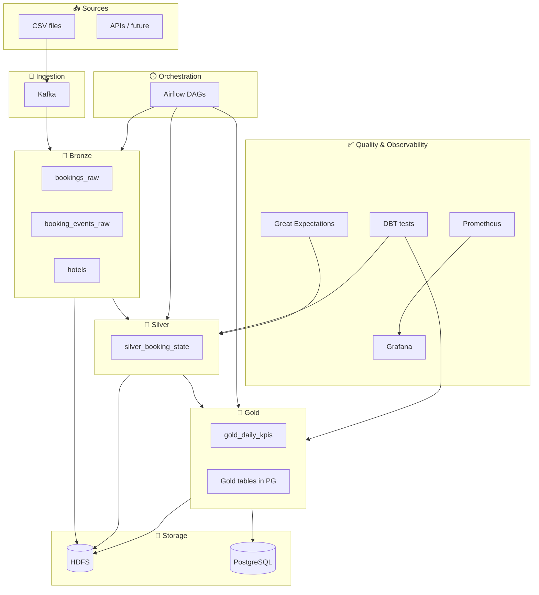

**In one sentence:** Data flows **CSV → Kafka → Bronze (HDFS/Iceberg) → Silver (HDFS/Iceberg) → Gold (HDFS/Iceberg + PostgreSQL)**, with **Airflow** running the jobs, **DBT** doing SQL transforms and tests, and **Prometheus/Grafana** watching health.

---

## 2. Tools We Chose (and Why)

| Tool | What it does (simple) | Why we chose it |
|------|------------------------|------------------|
| **Kafka** | Message bus: producers send events, consumers read them in order. | Decouples data producers from consumers; we can replay and scale consumers; industry standard for event streaming. |
| **HDFS** | Distributed file system: files are split and replicated across nodes. | Durable, scalable storage for the lakehouse; works well with Spark and Iceberg. |
| **Apache Iceberg** | Table format on top of files: ACID, schema evolution, time travel. | We get “real” tables (updates, deletes, merges) on top of Parquet files without a heavy metastore. |
| **Apache Spark** | Engine to process huge datasets in memory/disk across machines. | One stack for batch and streaming; Python (PySpark) and SQL; native Kafka and Iceberg support. |
| **DBT** | “Transformations as code”: SQL models + tests + docs. | SQL-first, versioned, testable pipelines; clear lineage; same logic in notebooks and production. |
| **Airflow** | Scheduler and orchestrator: run tasks on a schedule or when others finish. | Industry standard; we can run Spark, DBT, and Python in order with retries and monitoring. |
| **Trino** | SQL query engine over many data sources. | Fast analytical queries on Iceberg/HDFS (and others) without loading into a DB. |
| **PostgreSQL** | Relational database. | Gold KPIs are written here for BI tools and apps that expect a classic database. |
| **Great Expectations** | Data quality: “expect” column stats, uniqueness, etc. | Validates DataFrames/tables so we catch bad data early. |
| **Prometheus + Grafana** | Metrics storage and dashboards. | Counters and latencies for pipelines and services; same stack used in production everywhere. |
| **Docker Compose** | Run all services as containers on one network. | One command to bring up Kafka, HDFS, Spark, Airflow, etc., with consistent versions. |

---

## 3. End-to-End Data Flow

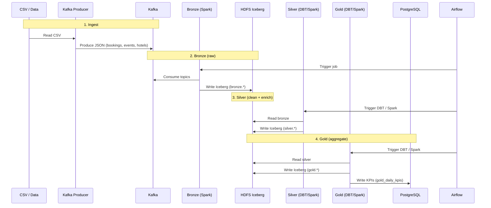

---

## 4. Project Structure

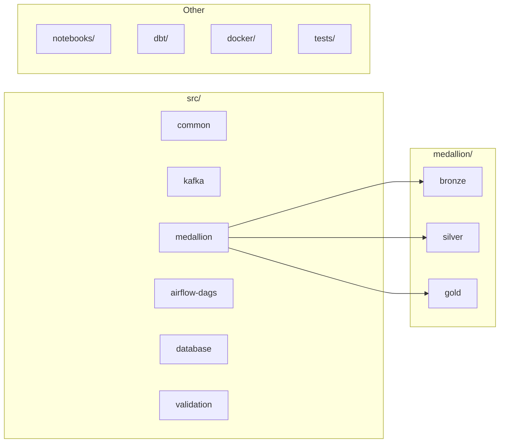

| Path | Purpose |
|------|--------|
| `src/common/` | Config, Spark session, Iceberg helpers, logging, metrics. |
| `src/kafka/` | Producer (CSV → Kafka) and consumer (Kafka → Python). |
| `src/medallion/bronze/` | Kafka → Iceberg (streaming or batch). |
| `src/medallion/silver/` | Booking state reconciliation (dedup + events). |
| `src/medallion/gold/` | Daily KPIs by city; write to Iceberg + PostgreSQL. |
| `src/airflow-dags/` | DAGs for bronze, silver, gold, data quality. |
| `src/database/` | PostgreSQL writer (Gold tables). |
| `src/validation/` | Great Expectations validator. |
| `notebooks/` | Step-by-step notebooks (Kafka, Bronze, Silver, Gold). |
| `dbt/` | DBT project: models (silver, gold), tests, profiles. |
| `docker/` | Docker Compose and Dockerfiles for all services. |

---

## 5. Ingestion: Kafka & Producer

**Idea:** We don’t write directly to the lake. Data first goes to **Kafka topics**. Later, Spark (or others) reads from Kafka and writes to Bronze. That way we can replay, add new consumers, and handle backpressure.

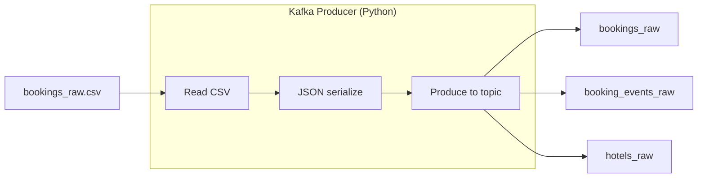

**Main class: `KafkaProducer`** (`src/kafka/producer.py`)

- **`__init__(bootstrap_servers, schema_registry_url)`**  
  Connects to Kafka brokers. We use a simple JSON producer (no Avro in the minimal path).
- **`produce(topic, key, value)`**  
  Sends one message: `value` is a dict, serialized to JSON.
- **`flush()`**  
  Waits until all buffered messages are sent.

**Helper: `produce_bookings(csv_path, topic, ...)`**  
Reads a CSV, converts each row to a dict, and calls `produce()` for each. Same idea exists for events and hotels.

**Why Kafka?** So ingestion (producer) and processing (Bronze job) are independent; we can run the producer from a notebook or script and the Bronze job from Airflow on a schedule or as a long-running stream.

---

## 6. Bronze Layer (Raw Storage)

**Idea:** Bronze = “raw” layer. We read from Kafka and write **as-is** (plus parsing and metadata) into Iceberg tables on HDFS. No business logic, no deduplication—just land the data.

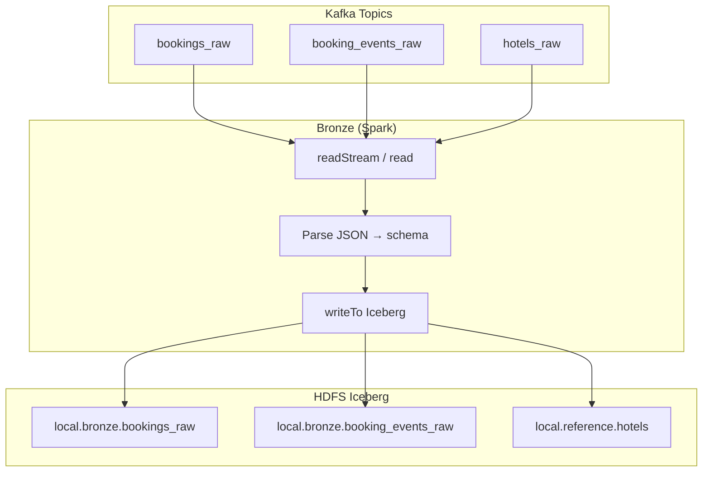

**Main class: `BronzeIngestion`** (`src/medallion/bronze/kafka_to_iceberg.py`)

- **`__init__(spark)`**  
  Stores Spark session and config (Kafka bootstrap servers, checkpoint path for streaming).
- **`read_kafka_stream(topic, schema)`**  
  Uses `spark.readStream.format("kafka")` (or batch `read`), subscribes to `topic`, parses the value column with `from_json(..., schema)`, and adds `topic`, `partition`, `offset`, `kafka_timestamp`, `processing_ts`. Returns a (streaming or batch) DataFrame.
- **`write_to_iceberg(df, table_name, checkpoint_suffix)`**  
  Writes the DataFrame to the Iceberg table (e.g. `local.bronze.bookings_raw`) with checkpoint for streaming so we can resume.

**Schemas:** `BOOKING_SCHEMA`, `BOOKING_EVENT_SCHEMA`, `HOTEL_SCHEMA` are fixed StructTypes so Spark knows how to parse the JSON from Kafka.

**Why Iceberg?** So we get a single table abstraction (partitioning, compaction, schema evolution) on top of Parquet files in HDFS, and Spark can read/write with one catalog.

---

## 7. Silver Layer (Cleaned & Enriched)

**Idea:** Silver = “clean and useful” layer. We **deduplicate** bookings and events, **reconcile** status from events with booking attributes, and **enrich** with hotel data (e.g. city). One row per booking.

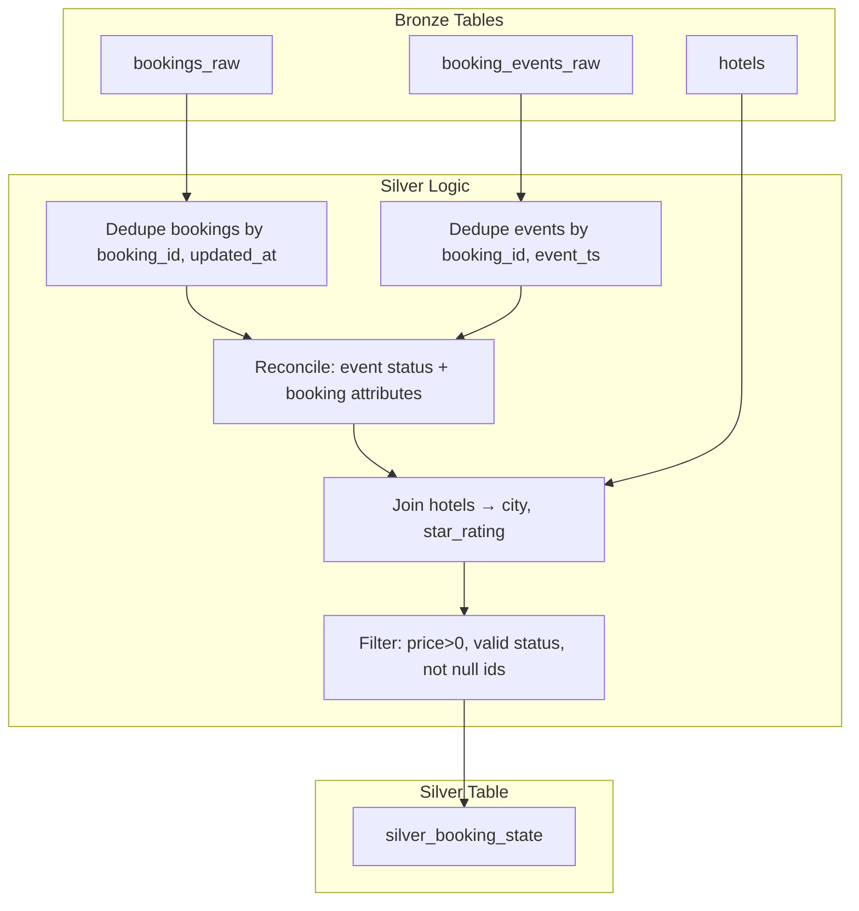

**Main class: `BookingStateReconciliation`** (`src/medallion/silver/booking_state_reconciliation.py`)

- **`read_bronze_bookings/events/hotels()`**  
  Reads the corresponding Bronze Iceberg table from HDFS and returns a Spark DataFrame.
- **`deduplicate_bookings(bookings_df)`**  
  Window: `PARTITION BY booking_id ORDER BY updated_at DESC`, then take `row_number() == 1`. One row per booking (latest update).
- **`deduplicate_events(events_df)`**  
  Same idea: one row per booking_id with latest `event_ts`.
- **`reconcile_state(bookings_df, events_df)`**  
  Joins deduplicated bookings and events on `booking_id`. Status can come from the event (e.g. “confirmed”) and the rest (user_id, hotel_id, price, created_at) from the booking. Returns one DataFrame per booking with a single reconciled status.
- **`enrich_with_hotels(reconciled_df, hotels_df)`**  
  Joins with hotels to add `city`, `star_rating`.
- **`write_silver(...)`**  
  Writes the final DataFrame to the Silver Iceberg table (e.g. `local.silver.booking_state`).

**Why do we need this?** Because the same booking can appear multiple times (updates) and events can arrive out of order. Silver gives a single, clean “current state” per booking plus dimensions (city) for analytics.

---

## 8. Gold Layer (Aggregated KPIs)

**Idea:** Gold = “analytics-ready” aggregates. We group Silver by **date and city** and compute KPIs: counts (total, confirmed, cancelled), revenue, cancellation rate, average price, etc. We write to **Iceberg** (for Trino/Spark) and **PostgreSQL** (for BI tools).

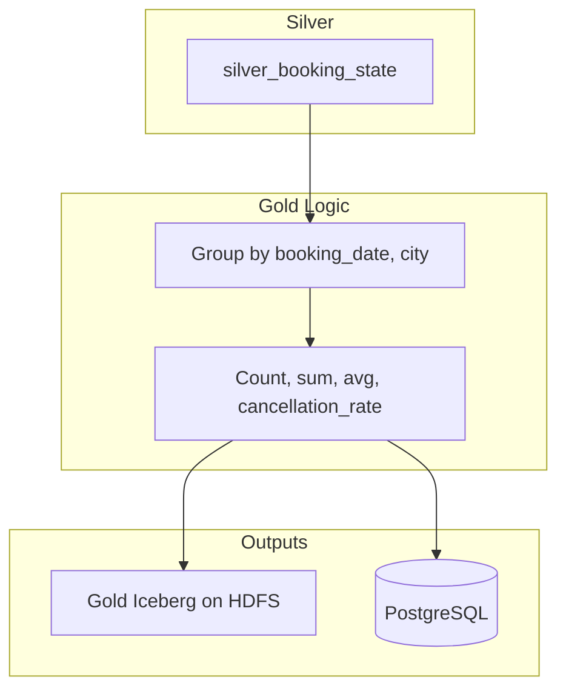

**Main class: `GoldLayer`** (`src/medallion/gold/daily_kpis.py`)

- **`calculate_daily_kpis(silver_table)`**  
  Reads the Silver table, truncates `created_at` to day, groups by `(booking_date, city)`, and aggregates:  
  `total_bookings`, `confirmed_bookings`, `cancelled_bookings`, `total_revenue` (confirmed only), `cancellation_rate`, `avg_booking_price`, etc.
- **`write_to_postgres(kpis_df, table, jdbc_url, properties)`**  
  Writes the KPIs DataFrame to PostgreSQL via JDBC (Spark) so BI tools can query a normal table.

**PostgreSQL writer: `PostgresWriter`** (`src/database/postgres.py`)

- **`create_gold_tables()`**  
  Creates `gold_daily_kpis` (and similar) if not exists.
- **`write_spark_dataframe(df, table, mode)`**  
  Uses `df.write.format("jdbc")` to push the Gold DataFrame into PostgreSQL.

**Why both Iceberg and PostgreSQL?** Iceberg keeps Gold in the lake (Trino, Spark, time travel). PostgreSQL gives a simple SQL interface for dashboards and apps.

---

## 9. DBT (Transformations as Code)

**Idea:** DBT runs **SQL models** that read from Bronze/Silver and write to Silver/Gold. Same logic can be run from the CLI (e.g. in Airflow) or from notebooks. DBT also runs **tests** (e.g. uniqueness, not null) and builds **lineage**.

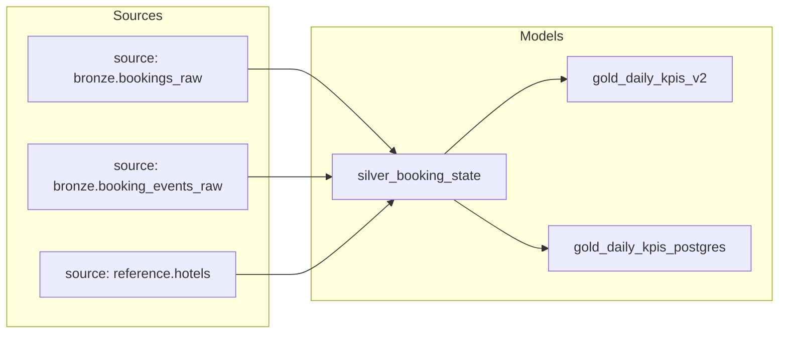

**Important files**

- **`dbt/dbt_project.yml`**  
  Project name, model paths, and **default config**: Silver/Gold models are `materialized: incremental`, `file_format: iceberg`, `incremental_strategy: merge`, with Snappy Parquet.
- **`dbt/profiles.yml`**  
  Targets (dev, local, local_docker, prod): Spark connection (Thrift or session) with Iceberg catalog pointing at `hdfs://namenode:9000/lakehouse`, or PostgreSQL for prod Gold.
- **`dbt/models/silver/silver_booking_state.sql`**  
  - Reads from `{{ source('bronze', 'bookings_raw') }}` and `{{ source('reference', 'hotels') }}`.  
  - Deduplicates with `ROW_NUMBER() OVER (PARTITION BY booking_id ORDER BY updated_at DESC)`.  
  - Joins with hotels for `city`, `star_rating`.  
  - Filters: `price > 0`, `status IN ('created','confirmed','cancelled')`, `created_at <= updated_at`, required fields not null.  
  - Writes to the Silver Iceberg table (incremental merge).
- **`dbt/models/gold/gold_daily_kpis_v2.sql`**  
  - Reads from `{{ ref('silver_booking_state') }}`.  
  - Groups by `DATE(created_at)`, `city`.  
  - Aggregates: counts, cancellation_rate, total_revenue, avg prices, etc.  
  - Writes to Gold Iceberg (incremental merge).

**Why DBT?** So transformations are versioned SQL, testable, and documented; we avoid duplicating logic between Python and SQL.

---

## 10. Airflow (Orchestration)

**Idea:** Airflow **DAGs** define when and in what order jobs run. We use them to run Bronze ingestion (Spark), Silver/Gold (Spark or DBT), and data quality checks.

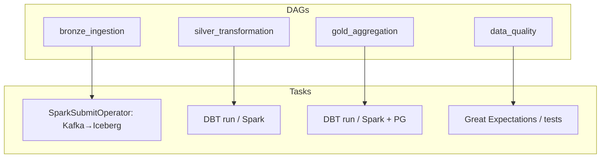

**Example: `bronze_ingestion_dag.py`**

- **DAG:** `bronze_ingestion`, schedule `@once`, one active run.
- **Task 1:** `SparkSubmitOperator` runs the Bronze Spark job (Kafka → Iceberg) with Iceberg and HDFS config.
- **Task 2:** `PythonOperator` runs a small health-check function after the Spark job.

Other DAGs follow the same pattern: trigger the right job (Spark or DBT) with the right config so Bronze → Silver → Gold run in order when we want.

---

## 11. Configuration & Common Utilities

**Idea:** One place for all settings (Kafka, Spark, HDFS, Iceberg, Postgres, pipeline, monitoring) so we don’t scatter magic strings.

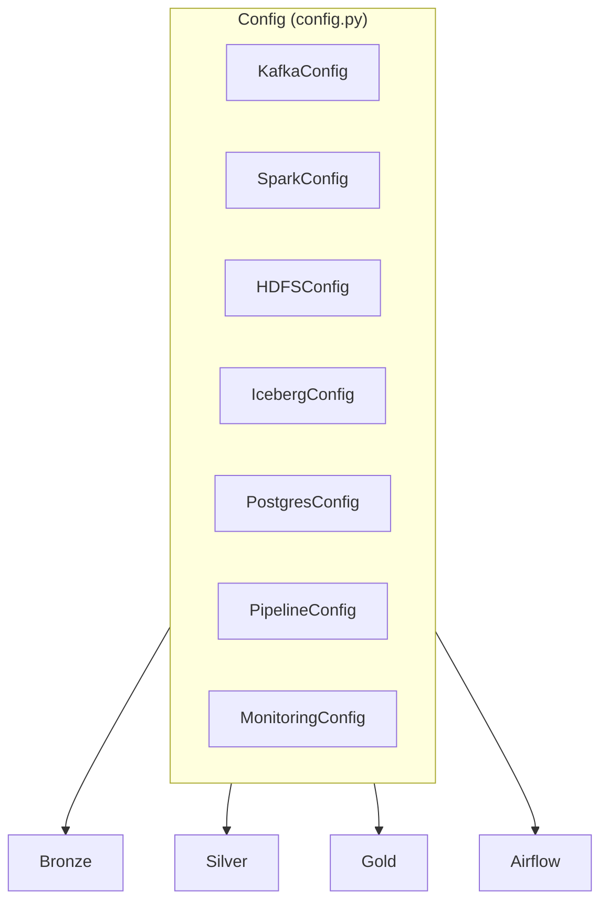

**`Config` and dataclasses** (`src/common/config.py`)

- **`KafkaConfig`**  
  `bootstrap_servers`, `schema_registry_url`, `consumer_group_id`, `auto_offset_reset`, `max_poll_records`.
- **`SparkConfig`**  
  `master`, `executor_memory`, `driver_memory`, `executor_cores`, `min/max_executors`.
- **`HDFSConfig`**  
  `namenode_host`, `namenode_port`, `replication_factor`; property `namenode_url` → `hdfs://host:port`.
- **`IcebergConfig`**  
  `warehouse_path`, `catalog_type`; properties for `bronze_namespace`, `silver_namespace`.
- **`PostgresConfig`**  
  Host, port, database, user, password; properties `connection_url`, `jdbc_url`.
- **`PipelineConfig`**  
  `watermark_delay_hours`, `checkpoint_location`, `data_retention_days`, `environment`.
- **`MonitoringConfig`**  
  Prometheus pushgateway, metrics on/off, log level.

**Global:** `config = Config()` so any module can do `from src.common.config import config` and use `config.kafka.bootstrap_servers`, etc.

**Spark session** (`src/common/spark_session.py`)

- **`create_spark_session(app_name, master, enable_hive, iceberg_enabled, kafka_enabled)`**  
  Builds a Spark session with adaptive execution, Kryo, Arrow, Parquet options, and (if enabled) Iceberg catalog `local` → HDFS warehouse and Hive support.
- **`get_or_create_spark_session(app_name, **kwargs)`**  
  Returns the active session if there is one, otherwise calls `create_spark_session`.

**Iceberg helpers** (`src/common/iceberg_utils.py`)

- **`create_iceberg_table(spark, table_name, schema, partition_by, namespace)`**  
  Creates namespace if needed and table with Parquet + Snappy and format-version 2.
- **`write_to_iceberg(df, table_name, mode, namespace)`**  
  Writes a DataFrame to `local.{namespace}.{table_name}`.
- **`merge_into_iceberg(...)`**  
  Wraps Spark’s Iceberg MERGE for upserts (used in Silver/Gold pipelines).

---

## 12. Validation & Monitoring

**Validation (Great Expectations)**  
`DataValidator` in `src/validation/great_expectations_validator.py` loads a Great Expectations context and runs an expectation suite against a Spark DataFrame. Used to validate Silver (and optionally Bronze/Gold) before or after writing.

**Metrics (Prometheus)**  
`src/common/metrics.py` defines counters/histograms/gauges (e.g. `records_processed`, `processing_duration`, `pipeline_lag`, `kafka_consumer_lag`, `data_quality_failures`) and can push them to a Prometheus pushgateway so Grafana can show pipeline health.

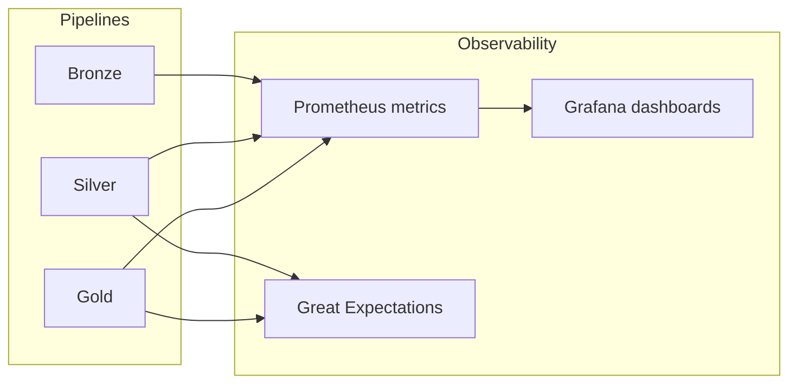

---

## 13. Key Classes & Functions Deep Dive

### For dummies: what each piece does in one line

| Class / Function | One-line role |
|------------------|----------------|
| `KafkaProducer` | Sends messages (e.g. from CSV) to Kafka topics. |
| `BronzeIngestion.read_kafka_stream` | Reads a Kafka topic into a Spark DataFrame with a given schema. |
| `BronzeIngestion.write_to_iceberg` | Writes that DataFrame to an Iceberg table (Bronze/reference). |
| `BookingStateReconciliation.deduplicate_bookings` | Keeps only the latest row per `booking_id` (by `updated_at`). |
| `BookingStateReconciliation.reconcile_state` | Combines bookings + events so each booking has one status and one set of attributes. |
| `GoldLayer.calculate_daily_kpis` | Groups Silver by date + city and computes counts, revenue, cancellation rate, etc. |
| `PostgresWriter.write_spark_dataframe` | Saves a Spark DataFrame into a PostgreSQL table via JDBC. |
| `create_spark_session` | Builds a Spark session with Iceberg catalog and HDFS warehouse. |
| `Config` | Holds all Kafka, Spark, HDFS, Iceberg, Postgres, pipeline, and monitoring settings. |
| DBT `silver_booking_state` | SQL that dedupes Bronze bookings, joins hotels, filters bad rows, writes Silver. |
| DBT `gold_daily_kpis_v2` | SQL that aggregates Silver by date/city and writes Gold Iceberg. |
| Airflow `bronze_ingestion` DAG | Runs the Spark job that reads Kafka and writes Bronze Iceberg. |

### Flow of a single booking (conceptual)

1. **CSV** → Producer sends a row to `bookings_raw` (and possibly events to `booking_events_raw`).
2. **Kafka** holds the message until a consumer reads it.
3. **Bronze** job reads from Kafka and appends to `local.bronze.bookings_raw` (and events/hotels to their tables).
4. **Silver** (Spark or DBT) reads Bronze, dedupes, reconciles with events, joins hotels, filters; writes one row per booking to `silver_booking_state`.
5. **Gold** (Spark or DBT) reads Silver, groups by date and city, aggregates; writes to Gold Iceberg and to PostgreSQL `gold_daily_kpis`.

---

## 14. Quick Reference

### Run the platform (Docker)

```bash
cd docker
docker compose -f docker-compose.yml up -d
# Optional: start Jupyter in Docker to avoid HDFS RPC issues from host
docker compose -f docker-compose.yml up -d notebook
# Open http://localhost:8888 for notebooks
```

### Run notebooks (order)

1. `01_kafka_service.ipynb` — Produce sample data to Kafka.
2. `02_bronze_layer.ipynb` — Consume Kafka → Bronze Iceberg (run in Docker Jupyter if you hit “RPC response has invalid length” on host).
3. `03_silver_layer.ipynb` — Bronze → Silver (reconciliation).
4. `04_gold_layer.ipynb` — Silver → Gold + PostgreSQL.

### Run DBT

```bash
cd dbt
dbt deps
dbt run --target local_docker   # or dev / prod
dbt test
```

### Important URLs (default)

| Service | URL |
|--------|-----|
| HDFS NameNode | http://localhost:9870 |
| Trino | http://localhost:8083 |
| Airflow | http://localhost:8090 |
| Grafana | http://localhost:3000 |
| Prometheus | http://localhost:9090 |
| Jupyter (Docker) | http://localhost:8888 |

---

---

## 15. Medallion Layers (Detail)

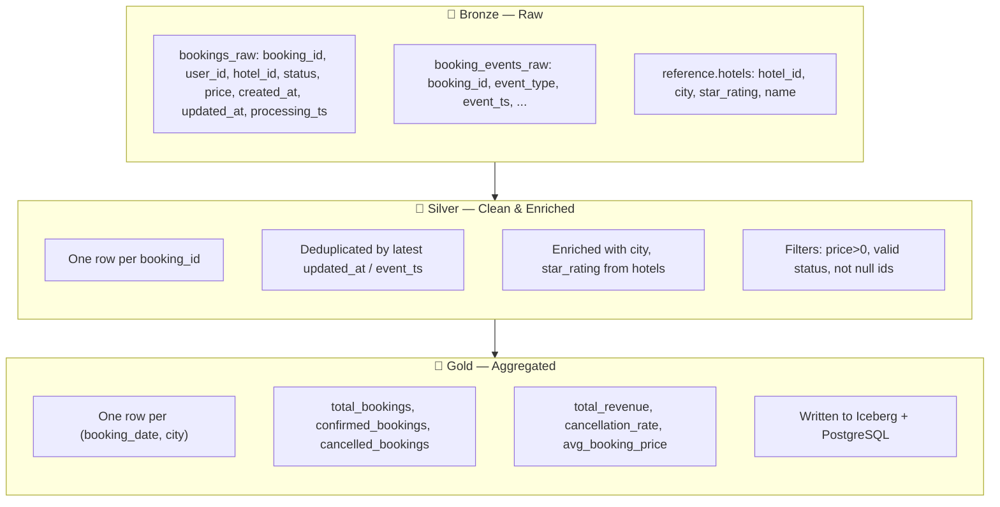

---

## 16. Services & Ports (Docker)

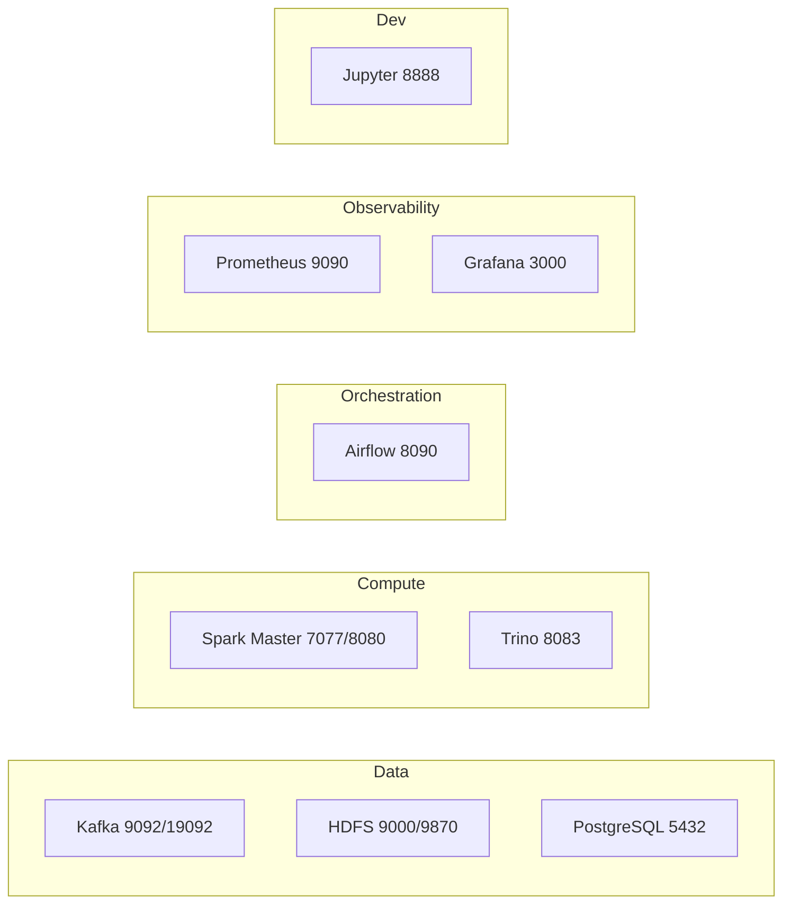

---

**End of onboarding tutorial.** For more detail, see the root `README.md` and the docstrings in `src/`.
